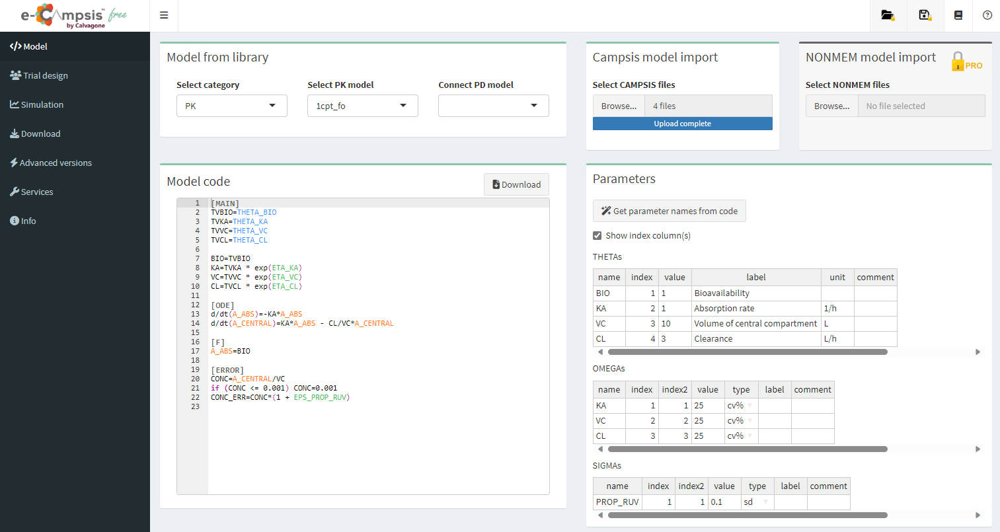

# Model tab

## Model from library
When entering the app, a simple PK model is already loaded by default.

A different PK model can be selected from a large library ("Select PK model"), or a PD model can be connected ("Connect PD model") to the PK model. In "Select category", NONMEM models or TMDD models can be also loaded.

## Campsis model import
An existing Campsis model can be uploaded from this box (including files *model.campsis*, *omega.csv*, *theta.csv* and *sigma.csv*). 

## NONMEM model import
In the pro version, an existing NONMEM model can be uploaded from this box (including files *.mod* and *.ext*).

The NONMEM import functionality will be installed, the process can take several minutes. A notification will popup when done.

## Model code
The model code is shown in the editor window where it can be easily modified. Please note that the code is case sensitive (e.g. *log*, *exp*, *sqrt* should be used). The power function is *pow(x,d)*, *x* to the power of *d*.

## Parameters
The list of parameters for THETA, OMEGA and SIGMA is given in this box. Their values and labels can be changed. Comments can be added.

The type for OMEGA and SIGMA can be changed: sd, var, covar, cv, cv%, cor, for standard deviation, variance, covariance, coefficient of variation, coefficient of variation (as %) or correlation, respectively.

Correlations between omegas can be added by right-clicking on a cell in the OMEGA table. For example, enter "KA, VC" as name, 1 and 2 in index and index2, and add the correlation value.

Clicking on "Get parameter names from code", the code will be scanned for the #THETA, #OMEGA and #SIGMA and the names will be extracted and added to the table.
