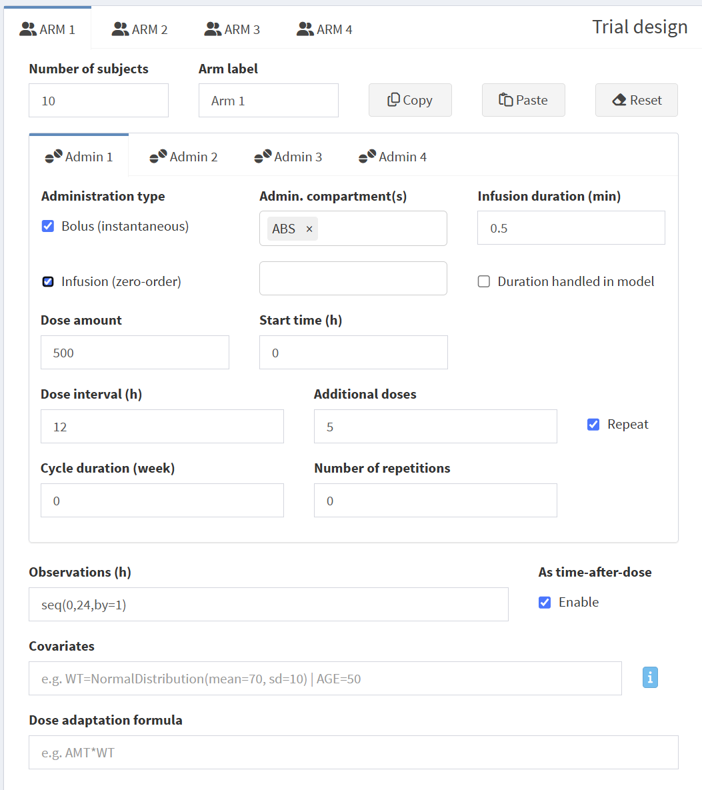
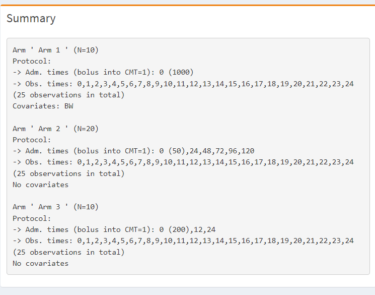

# Trial design

## Trial design

{width="500"}

The study arms can be configured here.

For each arm tab, the following information can be entered:

-   Number of subjects
    -   When set to 0 this arm is switched off.
-   Arm label
    -   Enter here the text that should appear on plots and tables identify the study arm
-   Administration type (bolus or infusion)
    -   If infusion is selected, you can choose whether the infusion is in the Model or in the Dataset; if the latter, the infusion duration can be entered
    -   Infusion into the Model means that the infusion duration is controlled by a parameter in the model. This is useful in cases where the infusion is actually not a real infusion but rather a 0-order input and you may have variability or covariates associate with it (e.g. a slow release formulation). See [here](https://calvagone.github.io/campsis.doc/articles/v06_infusions.html) for more information:
-   Dose amount and compartment
    -   The amount given into the specified compartment.
-   Dosing interval and additional doses
    -   The amount is repeatedly administered at a given interval for N additional doses (i.e. number of dosing events in addition to the first one)
-   Observations (observation time)
    -   to be written in R vector notation, e.g. *`seq(0,24,by=1)`*`or c(seq(0, 5), seq(0, 5)+168, seq(0,5)+336, seq(0,504,6))`
    -   Enable the "as-time-after-dose" box, if you want to replicate the observation schedule after each dose
    -   Be mindful with the number of observations that you choose as they contribute significantly to the size of the simulation and may cause memory issues.
-   Covariates
    -   Covariates or indicator variables that are used in the model code
    -   You can enter a single values: e.g. `BW=70|FLAG=1|SEX=1|BW=70`
    -   Or use the Campsis distribution functions, e.g:
        -   `BW=NormalDistribution(mean=70, sd=10)`
        -   `BW=LogNormalDistribution(meanlog=log(70), sdlog=0.2)`
        -   `HT=UniformDistribution(min=150, max=190)`
    -   It is also possible to enter a vector of values like so: `BW=c(50,60,70,80,90)`This is useful if you want to explore only certain specific covariate values. However, in this case you need to make sure that the length of the vector equals the number of subjects in the arm.r
    -   See [here](https://calvagone.github.io/campsis.doc/articles/v03_covariates.html) for more information about covariates:
-   Dose adaptation formula
    -   Useful if the dose has to be adapted to the body weight; e.g. `AMT*BW`

## Summary

{width="484"}

Here you will see a summary of your trial design. Especially when you have multiple arms with different schedules it is useful to have a look here and check if the design was correctly specified.

## Custom dataset

When you click on "Edit dataset" a window will pop-up that allows you specify complex dosing schedules usingn the Campsis functions.

{width="470"}

You can enter here for example loading doses or specific titration schemes etc.

[See the Campsis help](https://calvagone.github.io/campsis.doc/articles/v01_dataset.html) for details on how to enter complex trial designs.
