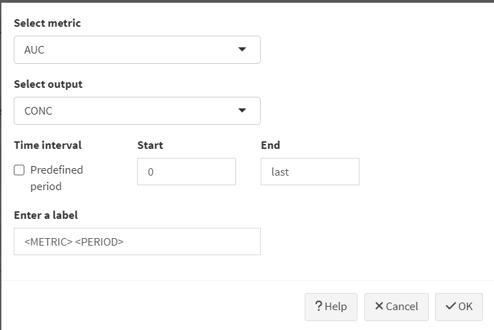
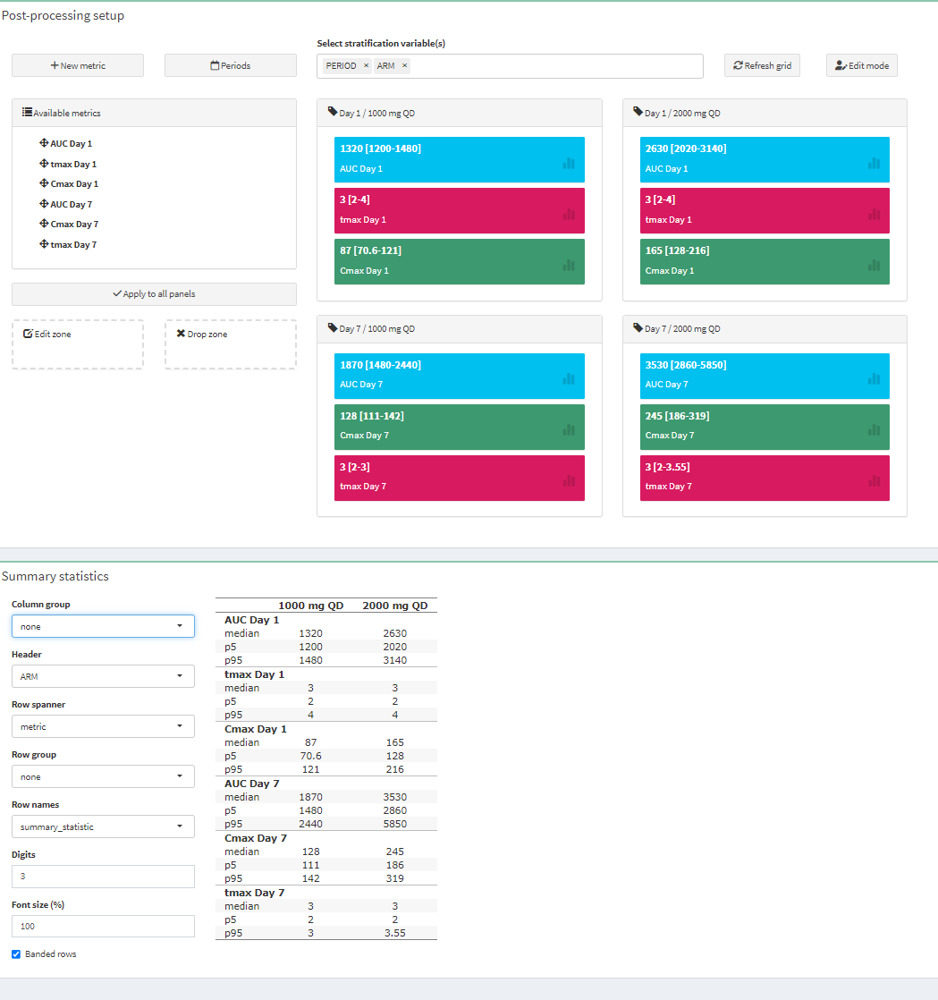

# Post-processing

After a simulation has completed, you can apply post-processing calculations to the simulation results. This way you can for example calculate non-compartmental PK parameters. The post-processing calculation will be performed for each individual separately. But the results can then be easily summarized in a table.

{width="628"}

The steps are:

1.  Add the metrics you are interested in

    {width="462"}

    -   Select the output variable that a metric should be derived from (e.g. concentration)
    -   All metrics are computed within a specified time interval
    -   Currently the following NCA metrics are available:
        -   AUC: area under the curve, calculated with the trapezoidal method
        -   Cmax: the maximum value of the selected output variable
        -   Tmax: the time at whjch the maximum value occurred
        -   Cmin: the lowest value in the interval
        -   Ctrough: the last value in the interval
        -   Cavg: the average concentration derived as: AUC/length_time_interval
        -   thalf: the half-life derived from the slope of the log-transformed variable values against time. **IMPORTANT:** all time points in the interval are used for the calculation. You need to check if this makes sense in your case, since most often you may actually be interested in the terminal part of the curve only.
    -   The default time interval is 0 to the last time point. You can also select previously defined and labelled periods. By default day 1 and day 7 (i.e. 0-24 and 144-168 hours) are available, but you can easily change this by clicking on the "Periods" button on the main screen.
    -   In the label field you can add your specific label. <METRIC> and <PERIOD> are placeholders that will be automatically filled in.

2.  Back on the main screen you can (and should) stratify the post-processing by SCENARIO, ARM and/or PERIOD (if it was defined)

3.  Click "Refresh grid"

    -   Boxes for the different strata will appear.

4.  Click the button 'Apply to all panels'

    -   Most often you want to calculate the same metrics in all strata
    -   However, it is also possible to apply different metrics to different strata. In this case simple drag-and-drop the metric to the strata box you want
    -   {width="400"}

5.  Click on the Calculate button !

    {width="494"}

Description of the options:

-   Edit zone: click on a metric and dragged it to this zone to edit it
-   Drop zone: if a metric had to be remove from one of the stratification, drag-and-drop to this zone
-   Refresh grid: to reset boxes
