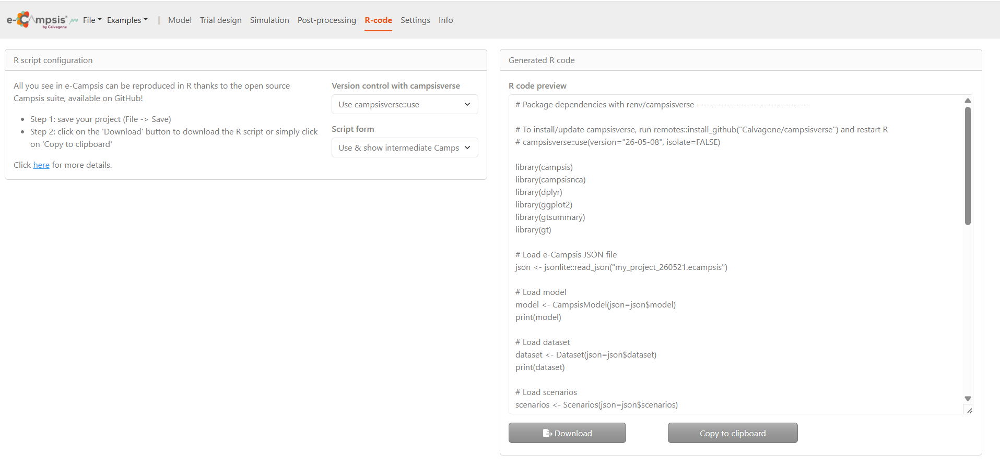

# R-code

In the **R-code** tab, users can reproduce the entire workflow from e‑Campsis in R.

On the left, the R script configuration section provides instructions explaining that all actions performed in the interface can be exported as an R script using the open-source Campsis ecosystem. Users are prompted to first save their project, then either download the generated script or copy it to the clipboard. 

Additional options include selecting the version control setup (via campsisverse) and choosing the script form, which determines how much detail (e.g., intermediate steps) is included in the generated code.Several options are available to control how the R script is generated:

* Version control with campsisverse:
    - Do nothing: no dependency management is applied
    - campsisverse::use: sets up dependencies for reproducibility
    - campsisverse::restore: restores a previously defined environment

* Script form:
    - Compact: minimal script
    - Use & show intermediate Campsis objects: includes intermediate objects for transparency
    - Use intermediate Campsis objects: uses them without displaying
    - Plotting only: generates code focused on visualization
    
On the right, the Generated R code panel displays a preview of the complete R script. This script includes loading required libraries (such as campsis, campsisnca, dplyr, and ggplot2), importing the project file in JSON format, and reconstructing key components such as the model, dataset, and scenarios. At the bottom, users can either Download the script as a file or Copy to clipboard, making it easy to run or further customize the analysis directly in an R environment.

