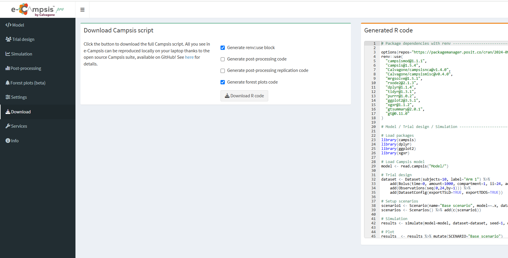

# Download

In the download section you can see the full R-code to run the simulation on your local machine. There are checkboxes that allow to include/remove certain sections that may not be needed.

Of course, post-processing or forest plot code can only be included in the script if you have run that simulation before.

Click the Download button to download zip file containing the full Campsis script as well as the model code and parameter tables. The script can be run locally with the open-source packages **campsis, campsismod, campsismisc and campsisnca.**

## Renv for total reproduceability (pro version only)

Simulations with e-Campsis depend on many R packages and it is quite likely that a script that runs today on your computer with the current versions of dependencies may not run without issues in a year or so when you update your R-installation the next time. To overcome this R-specific challenge you can include a `renv::use` block in your simulation script.

When you then execute the script on your computer a temporary renv-package library will be generated and all dependencies will be downloaded and installed with the exact same version as indicated. This will allow you to reproduce your simulations also 5 years from now without issues.

There are only two requirements for this to work:

1) renv must be installed in your R-environment first (read more about renv [here](https://rstudio.github.io/renv/articles/renv.html).

2) you need a C++ compiler to run `mrgsolve`. For Windows you simply need to install [Rtools](https://cran.r-project.org/bin/windows/Rtools/rtools44/rtools.html) first (currently version 4.4) . For mac and linux you need to install a fortran compiler (see [here](https://github.com/metrumresearchgroup/mrgsolve/wiki/mrgsolve-Installation#compilers-buid-tools) for instructions).
