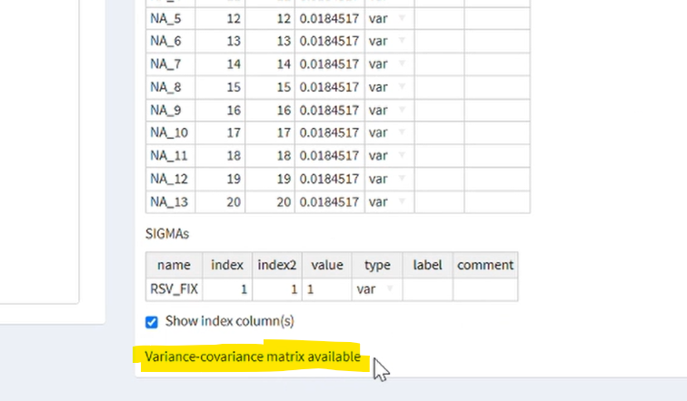
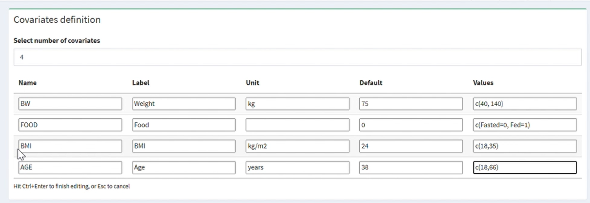
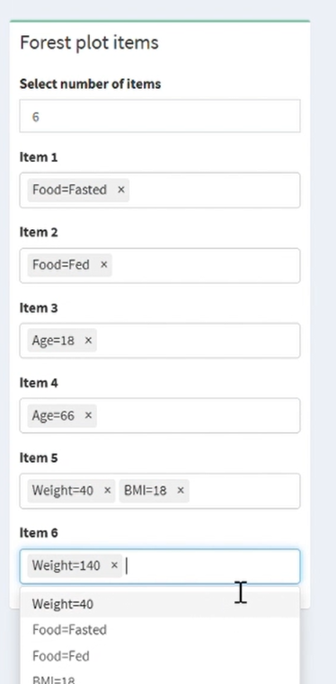

# Forest plots (pro version only)

## Pre-requisites

### Variance-covariance matrix

For a proper forest plot with error bars of uncertainty you will need to import a NONMEM model with a successful covariance step. So when importing a NONMEM model into e-Campsis make sure to select also the .cov file.

A message below the parameter tables will show if the variance-covariance matrix was properly loaded from the .cov file.

{width="467"}

Since the variance-covariance matrix is dependent on the parameter estimates, any change you now make manually to the parameter tables would invalidate the variance-covariance matrix and it won't be available for the forest plot simulations (or replicate simulations with uncertainty).

You still can create the forest plots as described below, however, they would not include error bars of uncertainty and just show you the mean covariate impact.

### Study design

You need to setup a trial arm first with dosing and sampling scheme, before you can run a forest plot. As you will see below, you will be able to use practically any derived variable for a forest plot, including design-sensitive NCA parameters, like half-life or Cmax, so be sure to choose apropriate sampling times.

Although not strictly required to run the forest plot, it is a good idea to enter the default covariate values here in the covariates field. This way you can check in the simulation tab that the profile for a typical or reference subject looks correct.

### Define outcome variables

You can create forest plots on any outcome variable you defined in the post-processing screen. So have a look at the post-processing section of this document.

Note that in order to use model parameters in the post-processing like CL or V, they need to appear in the [ERROR] block of the code - possibly with a different name to avoid conflicts.

## Select outcome variables and study arm

Once you have done the pre-work, you can go to the forest plot screen and choose the study arm that should be used for the simulations. In the same box you also select the outcome variables that you want to use.

## Select the covariates and define the values to explore

In the box on the top-right you define the covariate that you want to include in your forest plot simulations. Can can enter useful labels and add the units.

For continuous covariates you enter the default value, i.e. the value of the reference subject, as well as the lower and upper value to simulate. This could be, for example, the 5th and 95th percentile of that covariate's distribution, or any other value you deem appropriate to show.

For categorical covariates, you would enter the levels and map the numeric values to strings.

## Set the forest plot items

Now you can choose how many forest plot scenarios or items you want to simulate. Each items corresponds to a an error bar in the plot.

You can also select several covariate values to simulate the effect of several covariates together.

{width="233"}

## Run the simulation

If you are ready click on "Run simulation".

The confidence intervals in a forest plot will be generated by replicate simulations with random sampling from the variance-covariance matrix.

Since this is quite coputationally intensive and may take a while, we suggest you only run a few replicates online and if you are satisfied with the plots you download the automatically generated R-code and execute the big simulation on your computer offline (see section 'download').

The check-box 'parallel' execution and 'number of cores' have currently no effect for online execution. However, the corresponding code for running the simulation in parallel will be included in the downloadable R-script.

Once the simulation is finished you can change some plot settings to adjust the axis limits and breaks as well as the reference range and click through the results - one plot per outcome variable.

