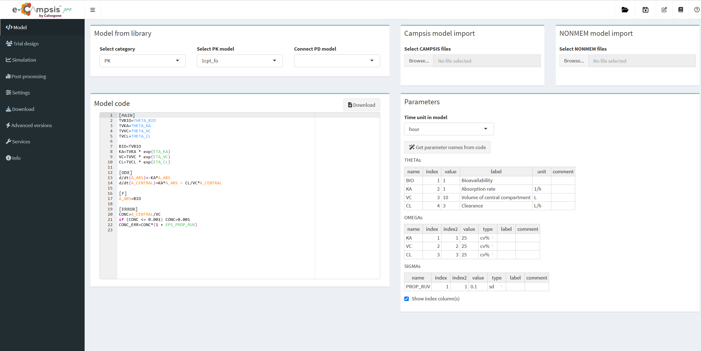

# Model tab

## Model from library

When entering the app, a simple PK model is already loaded by default.

A different PK model can be selected from a large library ("Select PK model").

In "Select category", NONMEM models or models for target-mediated drug disposition (TMDD) can be also loaded.

A PD model can be connected ("Connect PD model") to the PK model. This is done internally via campsismod (see [here](https://calvagone.github.io/campsismod.doc/articles/v06_append_pd_model.html)). If you do this you may have to check that the right PK output goes into the PD part of the model.

## Campsis model import

An existing Campsis model can be uploaded from this box (including files *model.campsis*, *omega.csv*, *theta.csv* and *sigma.csv*).

## NONMEM model import

{width=50px} &nbsp;This feature is reserved for pro users only.

In the pro version, an existing NONMEM control file (extension *.mod* and *.ctl* ) can be uploaded from this box. The parameter estimates will be extracted from the NONMEM control file unless you also select the corresponding *.ext* file. In this case the final parameter estimates will be used.

When you start the import for the first time it may take a short while (2-3 minutes) for the functionality to be available. A notification will popup when done and you may need to select the NONMEM files you want to import again. 

We have tested the translation of NONMEM models to Campsis for a number of models, but it is possible that some models are not correctly translated or fail. If you encounter such a model, please let us know and we will try to fix it.

In many cases you model will not run immediately after import. This is because you likely have variables (e.g. covariates or flagging variables) in your model that are not defined.
You can either edit the model code directly in the editor window (e.g. TRT = 1) or you can define the variables in the "Trial design" as a covariate.

## Model code

The model code is shown in the editor window where it can be easily modified. Please note that the code is case sensitive (e.g. *log*, *exp*, *sqrt* should be used). The power function is *pow(x,d)*, *x* to the power of *d*.
You can add comments using the # symbol.

Clicking on the "Download" button, Campsis model code will be downloaded as a ZIP folder, including *model.campsis*, *omega.csv*, *theta.csv* and *sigma.csv*.

## Parameters

The list of parameters for THETA, OMEGA and SIGMA is given in this box. Their values and labels can be changed. Comments can be added.

The type for OMEGA and SIGMA can be changed: sd, var, covar, cv, cv%, cor, for standard deviation, variance, covariance, coefficient of variation, coefficient of variation (as %) or correlation, respectively.

Correlations between omegas can be added by right-clicking on a cell in the OMEGA table. For example, enter "KA, VC" as name, 1 and 2 in index and index2, and add the correlation value.

Clicking on "Get parameter names from code", the code will be scanned for the strings *THETA_name*, *ETA_name* and *EPS_name* and the names will be extracted and added to the table.

