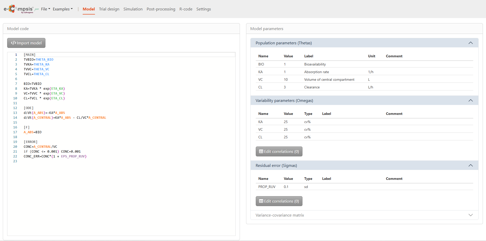
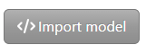
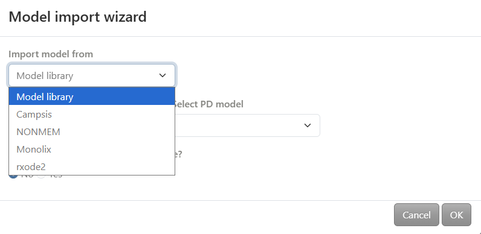
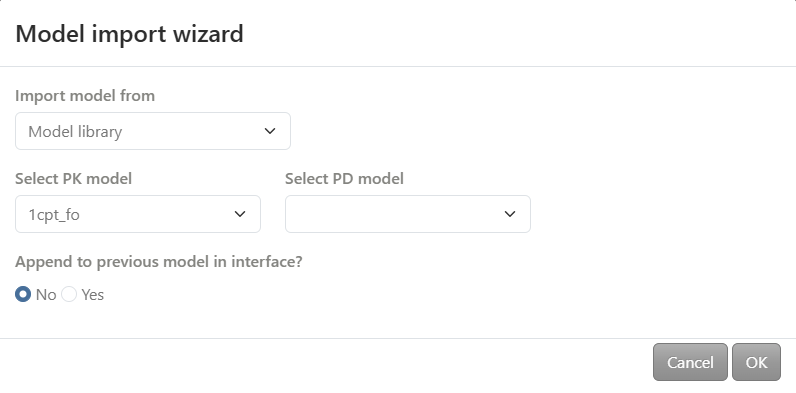
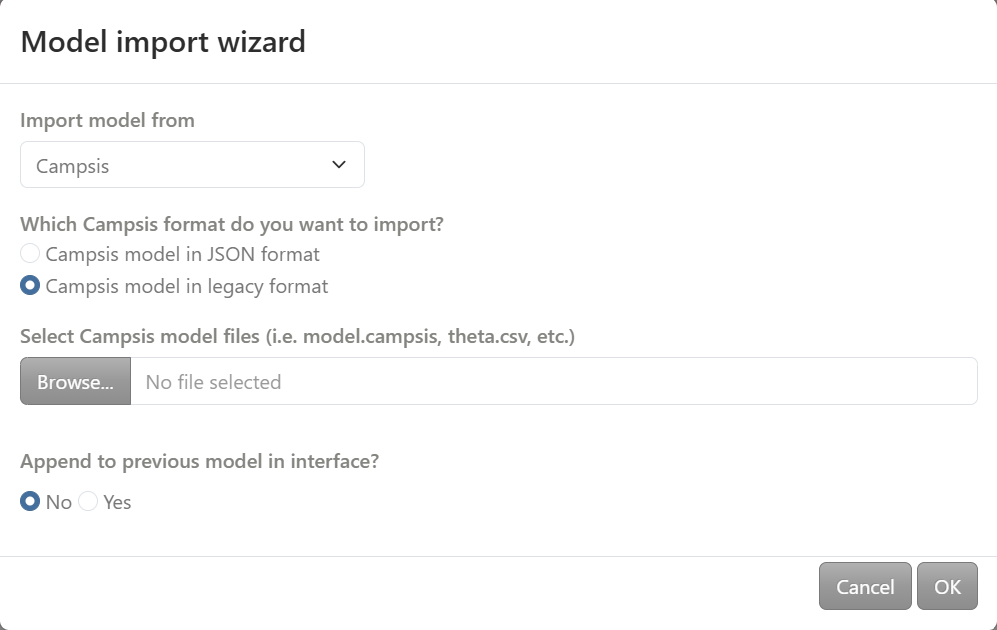
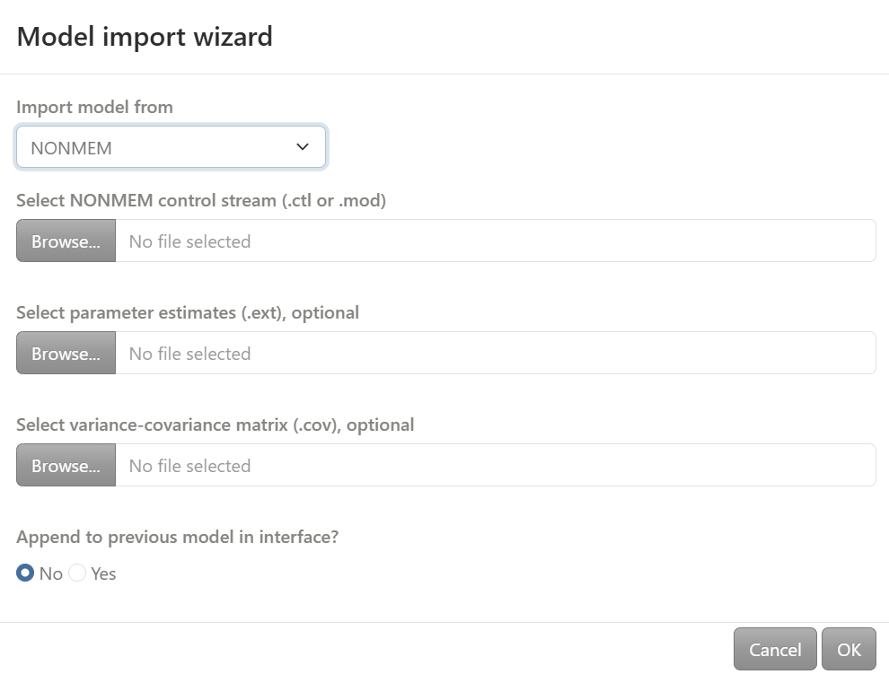

# Model tab

When you open the e‑campsis desktop application, the **Model** tab is displayed automatically. This page is divided into two main sections:

- On the left, the *Model code* section shows the full model script.
- On the right, the *Model parameters* section presents the population parameters (Theta), variability parameters (Omega), and residual error (Sigma), each presented in dedicated parameter sub-sections.

By default, a simple PK model from the model library is already loaded to help you get started.

## Model code section

In the *Model code* section, you have two options: 

### Writing a model from scratch

The **code editor** window allows direct creation of a model using the Campsis model syntax and includes syntax highlighting to make the structure and equations easy to read and modify. The editor displays the full PK model specification, organized into blocks such as *[MAIN]*, *[ODE]*, *[F]*, and *[ERROR]*,which define parameter initialization, differential equations, input mappings, and the residual error model.
Please note that the code is case sensitive (e.g. *log*, *exp*, *sqrt* should be used). The power function is *pow(x,d)*, *x* to the power of *d*.Comments can be added using the # symbol.

### Importing an existing model

An existing  model can be loaded through the **Import model** button:  { style="display: block; margin: 0 auto" }

Clicking this button opens the **Model import wizard** window.
The first element in this window is a dropdown menu labeled **Import model from**, which allows selecting the source of the model. Available options include *Model library*, *Campsis*, *NONMEM*, *Monolix*, and *rxode2*.

#### Model from library

When **Model library** is selected in the **Import model from** dropdown menu, predefined models from the built‑in Campsis model library become available for import.This option displays a list of available PK (**Select PK model**) and PD models (**Select PD model**) that can be loaded directly into the interface. Both lists are presented in dropdown menus, allowing selection from the available models in each category.

The exhaustive list of PK models is grouped into several categories in the model library and can be found:

- in the [PK](model-library.html#pk-section) section for simple PK model
- in the [TMDD](model-library.html#tmdd-section) section for target-mediated drug disposition model
- in the [NONMEM](model-library.html#nonmem-section) section for NONMEM‑derived models

A PD model can be connected to the selected PK model using **Select PD model**. This is done internally via campsismod (see [here](https://calvagone.github.io/campsismod.doc/articles/v06_append_pd_model.html)). When connecting a PD model, it is recommended to verify that the correct PK output variable is used as input to the PD component of the combined model.
Please note that it is not possible to import or define a PD model without an associated PK model.

#### Campsis model

When **Campsis** is selected in the **Import model from** dropdown menu, an existing Campsis model can be imported.

The window provides the following options:

- **Campsis format selection**: The model format can be selected as either a JSON format or a legacy format.
- **Campsis model files selection**: The Browse button is used to select the required Campsis model files from the local filesystem.Depending on the selected format, this may include a single JSON file or a set of legacy files such as *model.campsis*, *omega.csv*, *theta.csv* and *sigma.csv*.

#### NONMEM model import

When **NONMEM** is selected in the **Import model from** dropdown menu, an existing NONMEM model can be imported.

The window provides the following options:

- **Select NONMEM control stream**:A NONMEM control file (extension *.mod* and *.ctl* ) can be imported.By default, parameter estimates are extracted from the initial estimates defined in the control file. If a corresponding *.ext* file is also selected, the final parameter estimates from that file are used instead.
- **Select parameter estimates (optional)**: An optional *.ext* file containing parameter estimates from a previous NONMEM run can be provided. When selected, the final estimates from this file override those defined in the control stream.
- **Select variance–covariance matrix (optional)**: An optional *.cov* file containing the variance–covariance matrix of the parameter estimates from a previous NONMEM run can be provided.

At the first NONMEM import, the translation functionality may require a short initialization period (typically less than one minute). Once initialization is complete, a notification is displayed.
The translation of NONMEM models into Campsis has been tested on a variety of models; however, some models may not be fully supported and could be translated incorrectly or fail. If such a case is encountered, it is recommended to report it so the issue can be investigated.
In many cases, an imported NONMEM model may not run immediately. This usually occurs when the model contains variables (for example, covariates or flag variables) that are not yet defined in the interface. These variables can either be defined directly in the model code using the editor window (e.g. TRT = 1) or specified as covariates in the **Trial design** tab.

## Parameters

The list of parameters for THETA, OMEGA and SIGMA is given in this box. Their values and labels can be changed. Comments can be added.

The type for OMEGA and SIGMA can be changed: sd, var, covar, cv, cv%, cor, for standard deviation, variance, covariance, coefficient of variation, coefficient of variation (as %) or correlation, respectively.

Correlations between omegas can be added by right-clicking on a cell in the OMEGA table. For example, enter "KA, VC" as name, 1 and 2 in index and index2, and add the correlation value.

Clicking on "Get parameter names from code", the code will be scanned for the strings *THETA_name*, *ETA_name* and *EPS_name* and the names will be extracted and added to the table.

