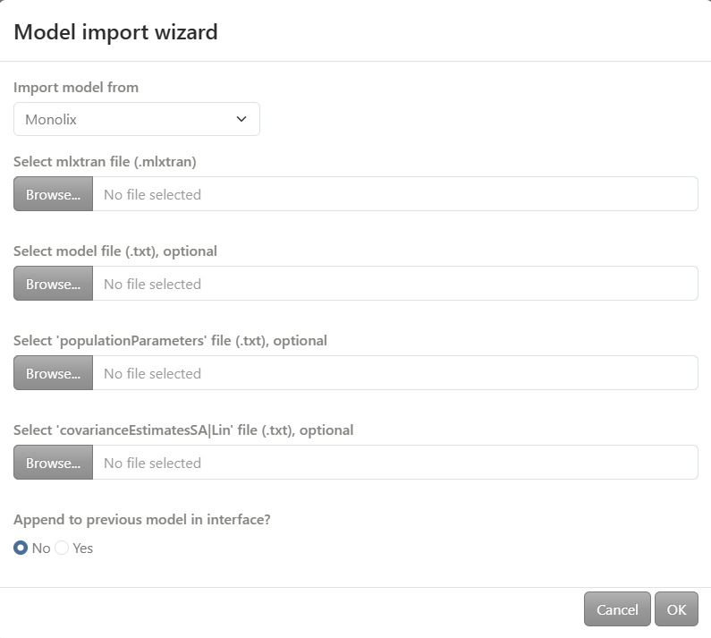
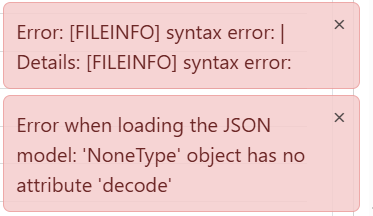
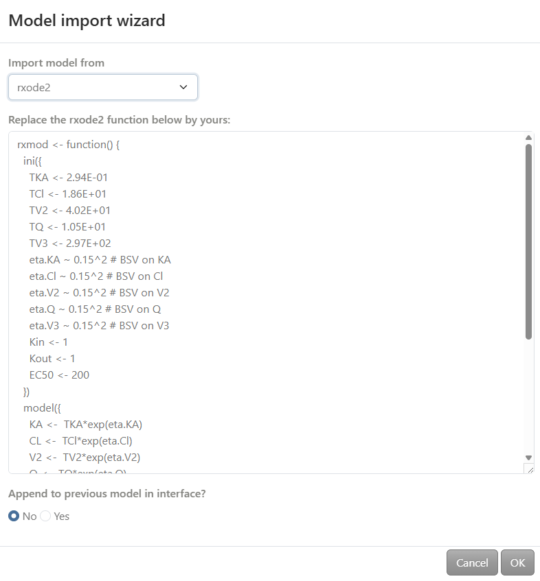
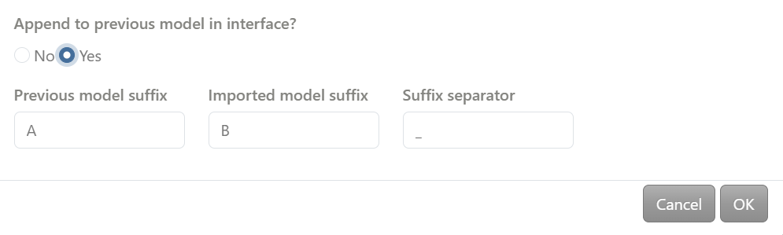
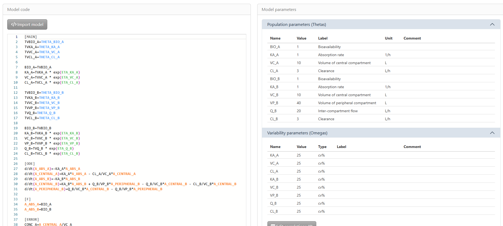
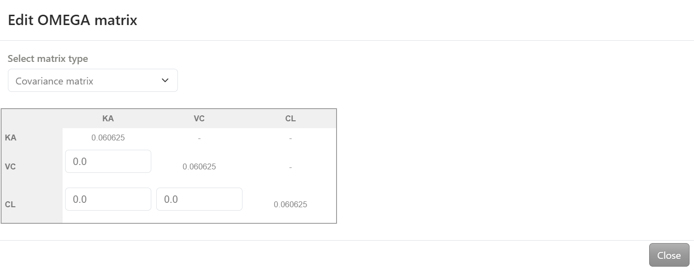
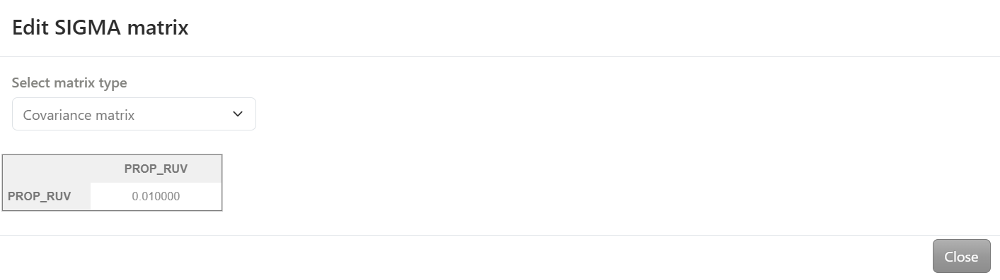

# Model tab

When you open the e‑campsis desktop application, the **Model** tab is displayed automatically. This page is divided into two main sections:

- On the left, the *Model code* section shows the full model script.
- On the right, the *Model parameters* section presents the population parameters (Theta), variability parameters (Omega), and residual error (Sigma), each in its own dedicated sub‑section.

By default, a simple PK model from the model library ([1cpt_fo](model-library.html#cpt_fo)) is already loaded to help you get started.

## Model code section

In the *Model code* section,  you can either write a model from scratch or import an existing model.

### Writing a model from scratch

The **code editor** window allows direct creation of a model using the Campsis model syntax.It includes syntax highlighting to make the structure and equations easier to read and modify. The editor displays the full PK model specification, organized into blocks such as *[MAIN]*, *[ODE]*, *[F]*, and *[ERROR]*,which define parameter initialization, differential equations, input mappings, and the residual error model.

Please note: 

- The code is case sensitive (e.g. *log*, *exp*, *sqrt* should be used). 
- The power function is *pow(x,d)*, *x* to the power of *d*.
- Comments can be added using the # symbol.

### Importing an existing model

An existing  model can be loaded through the **Import model** button:  { style="display: block; margin: 0 auto" }

Clicking this button opens the **Model import wizard** window.
At the top of this window, a dropdown menu labeled **Import model from** allows selecting the source of the model. Available options include *Model library*, *Campsis*, *NONMEM*, *Monolix*, and *rxode2*.

#### Model from library

When **Model library** is selected in the **Import model from** dropdown menu, predefined models from the built‑in Campsis model library are available for import.This option displays a list of available PK (**Select PK model**) and PD models (**Select PD model**) that can be loaded directly into the interface. Both lists are presented in dropdown menus, allowing selection from the available models in each category.

The exhaustive list of available models is grouped into several categories in the model library and can be found:

- in the [PK](model-library.html#pk-section) section for simple PK model
- in the [TMDD](model-library.html#tmdd-section) section for target-mediated drug disposition model
- in the [NONMEM](model-library.html#nonmem-section) section for NONMEM‑derived models
- in the [PD](model-library.html#pd-section) section for PD models

When connecting a PD model, it is recommended to verify that the correct PK output variable is used as input to the PD component of the combined model.

Please note that it is not possible to import or define a PD model without an associated PK model.

#### Campsis model

When **Campsis** is selected in the **Import model from** dropdown menu, an existing Campsis model can be imported.

The window provides the following options:

- **Campsis format selection**: The model format can be selected as either a JSON format or a legacy format.
- **Campsis model files selection**: The **Browse** button is used to select the required Campsis model files from the local filesystem. Depending on the selected format, this may include a single JSON file or a set of legacy files such as *model.campsis*, *omega.csv*, *theta.csv* and *sigma.csv*.

#### NONMEM model import

When **NONMEM** is selected in the **Import model from** dropdown menu, an existing NONMEM model can be imported.

The window provides the following options:

- **Select NONMEM control stream**:A NONMEM control file (extension *.mod* and *.ctl* ) can be imported.By default, parameter estimates are extracted from the initial estimates defined in the control file. 
- **Select parameter estimates (optional)**: An optional *.ext* file containing parameter estimates from a previous NONMEM run can be provided. When selected, the final estimates from this file override those defined in the control stream.
- **Select variance–covariance matrix (optional)**: An optional *.cov* file containing the variance–covariance matrix of the parameter estimates from a previous NONMEM run can be provided.

At the first NONMEM import, the translation functionality may require a short initialization period (typically less than one minute). Warning messages may be displayed once initialization is complete.

The translation of NONMEM models into Campsis has been tested on a variety of models; however, some models may not be fully supported and could be translated incorrectly or fail. If such a case is encountered, it is recommended to report it so the issue can be investigated.
In many cases, an imported NONMEM model may not run immediately. This usually occurs when the model contains variables (for example, covariates or flag variables) that are not yet defined in the interface. These variables can either be defined directly in the model code using the editor window (e.g. TRT = 1) or specified as covariates in the **Trial design** tab.

#### Monolix model import

When **Monolix** is selected in the **Import model from** dropdown menu, an existing Monolix model can be imported.

The window provides the following options:

- **Select mlxtran file**: A Monolix model file (extension *.mlxtran*) can be imported.This file contains the complete model definition and must include, at a minimum, the data definition, the model structure, an observation model with its associated error model, an explicit fit mapping, a complete list of parameters with their values and estimation status, and the executed tasks. These elements are required to reproduce the estimation run. All other sections (e.g. plots, settings, covariate details) are optional and informational.
- **Select model file**: A model description file (extension .txt) can be provided. When available, this file is used to complement the mlxtran model definition. When importing a model from the library, this file is required.
- **Select 'populationParameters' file  (optional)**: An optional *populationParameters.txt* file containing parameter estimates from a previous Monolix run can be provided. When selected, the final estimates from this file override those defined in the mlxtran file.
- **Select 'covarianceEstimatesSA|Lin' file (optional)**: An optional *covarianceEstimatesSA|Lin.txt* file containing the variance–covariance matrix of the parameter estimates from a previous MOnolix run can be provided.

As with NONMEM, a short initialization period may occur. Translation of Monolix models has not been tested exhaustively, and some models may not be fully supported.If an unsupported feature is encountered, the following error message is displayed:

{ style="display: block; margin: 0 auto" }

If such a case is encountered, it is recommended to report it so the issue can be investigated.

Please note that Theta values imported from Monolix are in the log domain and must be back‑transformed to obtain values in the linear domain.

#### rxode2 model import

When **rxode2** is selected in the **Import model from** dropdown menu, an rxode2 function can be pasted directly into the editor window.

#### Append model option

For all import methods, it is possible to append a new model to an existing one.
In this case, A suffix is automatically added to each model. By default, suffix A is assigned to the existing model and B to the imported model and the underscore (_) is used as a separator.

Both the model code and the model parameters are updated accordingly.
For example, appending a [2cpt_fo](model-library.html#cpt_fo-1) model to the default [1cpt_fo](model-library.html#cpt_fo) model produces the following result:

## Model parameters section

The *Model parameters* section presents the *population parameters (Theta)*, *variability parameters (Omega)*, and *residual error (Sigma)*, each in its own dedicated sub‑section.

Names, values, labels, and units can be edited by double‑clicking a field. Comments can also be added.

For **Omega** and **Sigma**, the parameter type can be changed to: *var* (default),*sd*, *cv* or *cv%* (corresponding to variance, standard deviation, coefficient of variation or coefficient of variation in %).

Covariance and correlation matrices between **Omegas** or **Sigmas** can be edited by clicking **Edit correlations** button: 

A dedicated window opens, where:

* Covariance matrix or Correlation matrix can be selected in the dropdown menu
* Values can be modified directly in the matrix 

