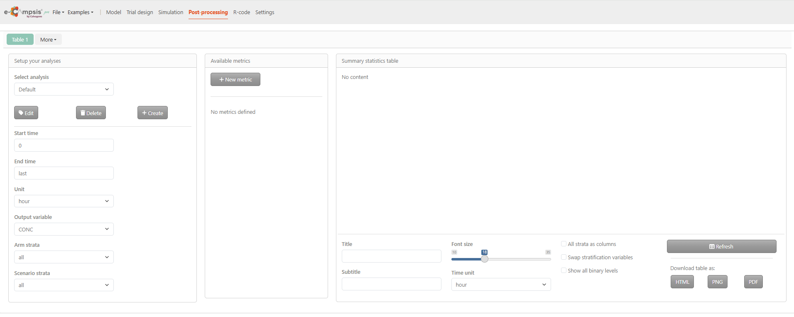
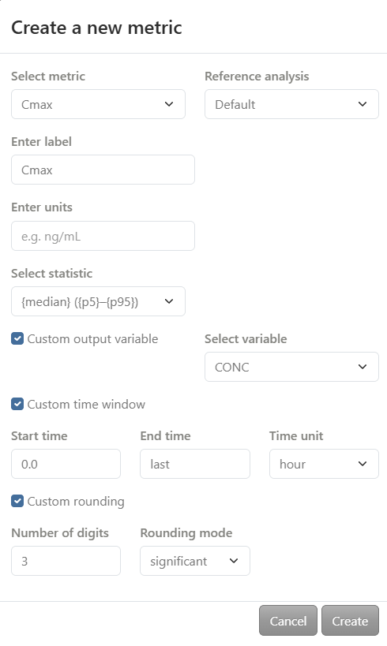
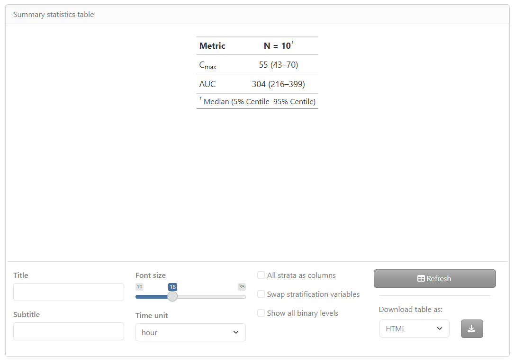
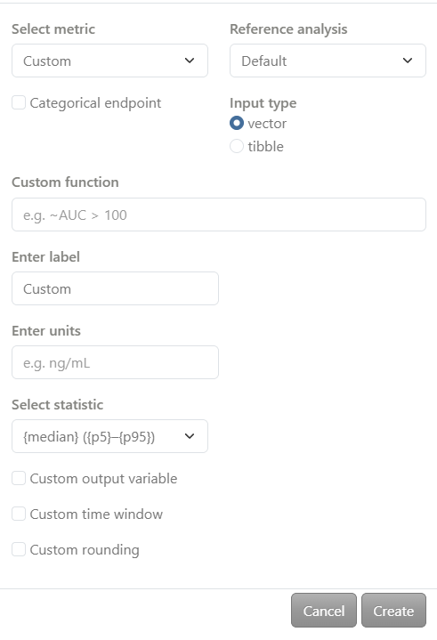
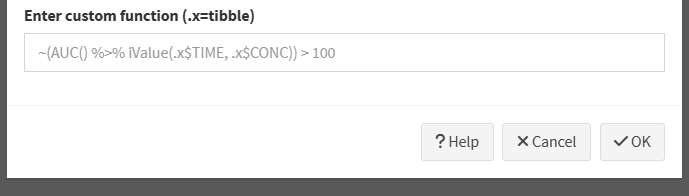

# Post-processing

By clicking on the **Post-processing** tab,  the e‑campsis application displays a structured workspace dedicated to analyzing and summarizing simulation results.The screen is organized into three main panels:

* On the left, a *Setup your analyses* section where users configure the analysis (time range, units, output variable, and stratification options)
* On the center, an *Available metrics* section used to define summary metrics, currently empty with an option to add new metrics.
* On the right, a *Summary statistics table* section where results are displayed once generated.




## Step-by-step guide

After a simulation has completed, post-processing calculations can be applied to the simulation results. This way non-compartmental PK parameters can be calculated. The post-processing calculation will be performed for each individual separately, but the results can easily be summarized in a table.

The steps are:

1.  **Setup your analyses** : This panel (on the left) is used to define how data should be analyzed—specifying the time range to consider, the output variable, and how results should be grouped (stratified). At the top, there is a dropdown menu labeled **Select analysis**, currently set to *Default*, which allows the user to choose an existing analysis configuration. Beside it are three buttons, *Edit*,*Delete*, and *+ Create*, used to modify, remove, or create analysis setups.
Below this, the user can define the analysis time range, with **Start time** set to *0* and **End time** set to *last*, indicating that the analysis spans from the beginning to the final available data point. The **Unit** dropdown is set to *hour*, defining the time measurement; other options such as *second*, *minute*, *day*, *week*, *month*, and *year* can also be selected.
Further down, the **Output variable** is set to *CONC*, which refers to concentration, indicating the variable being analyzed. Finally, the stratification options:**Arm strata** and **Scenario strata** are both set to *all*, meaning that the analysis includes all treatment groups and all scenarios without filtering. It is also possible to filter on one arm or one scenario.

2. **Define metrics**: By clicking on **+New metrics**button, , in the middle panel called **Available metrics**, a create a new metric editor opens.

    {width="462"}

    -   Select the analysis that a metric should be derived from by selecting it in **Reference analysis**.  All metrics are computed within a specified setup define in the previous step

    -   Currently the following NCA metrics are available:

        -   AUC: area under the curve. In select AUC method field, the AUC calculation method can be selected *linlin*, *linlog*, *tmax_linlog*
                -  lin–lin: Uses linear interpolation for all points (straight lines between values).
                -  lin–log: Uses linear interpolation when values increase and logarithmic interpolation when they decrease (better for elimination phase).
                -   tmax lin–log: Uses linear interpolation before Tmax and logarithmic interpolation after Tmax (separates absorption and elimination phases).
        -   Cmax: the maximum value of the selected output variable
        -   Tmax: the time at which the maximum value occurred
        -   Cmin: the lowest value in the interval
        -   Ctrough: the last value in the interval
        -   Cavg: the average concentration derived as: AUC/length_time_interval
        -   thalf: the half-life derived from the slope of the log-transformed variable values against time. **IMPORTANT:** all time points in the interval are used for the calculation. You need to check if this makes sense in your case, since most often you may actually be interested in the terminal part of the curve only.
        -   Max: the maximum value of the selected output variable
        -   Min: the minimum value of the selected output variable
        -   Last value:the last value of the selected output variable in the interval
        -   Avg: the average value of the selected output variable in the interval
        -   Time above: the total duration during which the value of the selected output variable remains above a specified threshold. The value can be entered in *Limit* field
        -   Time below: the total duration during which the value of the selected output variable remains below a specified threshold.The value can be entered in *Limit* field
        -   Custom: a custom metric defined as a function of the selected output variable (see below).


    -   The “Enter label” field allows the user to define a custom name for the metric
    
    -   the “Enter units” field allows specification of the measurement units (e.g., ng/mL). 

    -   Select the summary statistics that you want to use, e.g. mean and CV% or median and interquartile range. It is possible to provide a function for calculating a custom summary statistic.

    -   Additional customization options are enabled through checkboxes. 
         -   The “Custom output variable” option is selected, allowing the user to choose a specific variable—here set to CONC. 
         -   The “Custom time window” option is also enabled, with a start time of 0.0, an end time of last, and a time unit set to hour, allowing precise control of the time interval used for the metric calculation. 
         - The “Custom rounding” is activated, specifying 3 digits with a significant rounding mode to control numerical precision. 
        
At the bottom, the “Cancel” and “Create” buttons allow the user to discard changes or confirm the creation of the new metric.
    
3.**Create  Summary statistics table**: Once all metrics are defined, you can click on Refresh to generate and update the summary statistics table with the selected settings.Below the table, several display and export options are available. The user can enter a title and subtitle, adjust the font size using a slider, and select the time unit (currently set to hour). Additional checkboxes allow customization of the table layout, such as displaying all strata as columns, swapping stratification variables, or showing all binary levels. A Refresh button updates the table based on the current settings. Finally, the table can be exported using the Download table as option, with the format set to HTML, along with a download button to save the file.

{width="462"}

## Custom metric

Custom metrics allow you to define user-specific calculations based on the available data. To create one, select *Custom* as the metric type and enter a function using R syntax in the provided field (.
An optional “Categorical endpoint” checkbox can be enabled if the metric returns categorical values (e.g., TRUE/FALSE or text). You must also choose an input type:

- vector: works with the output variable and time vectors
- tibble: works with the full dataset for each individual
{width="462"}

### **Return categorical endpoint**

To check if the value of output variable (e.g. concentration) at the end of the interval is above 10 simply write:

`~ Last > 10`

This will evaluate to TRUE if the last concentration in the interval is above 10, and FALSE otherwise. You would need to check "Categorical endpoint" in this case.

In fact you can use standard R syntax as well as dplyr commands and return a text string instead of TRUE/FALSE:

`~case_when(Cmax < 50 ~ "P(< 50 ng/mL)", Cmax >= 50 & Cmax <= 60 ~ "P(50-60 ng/mL)", Cmax > 60 ~ "P(> 60 ng/mL)")` 

### Calculated from the vector of the output variable

If you select "Custom" as the metric type, you can define a custom metric as a function of the output variable. For example, you can derive the percentage of patients with the output variable (or derived metric thereof) exceeds a certain threshold for that individual. 

You can access the vector of the output variable by using `.y` and the vector of the time points by using `.x`. For example, the following custom function returns the maximum value of the output variable:

`~ max(.y)`

or use just the shortcut function:

`~ Max`

**Calculate the maximum change from baseline**, assuming that the baseline value is the first value of the output variable in our observation interval:

`~ max(.y) - .y[1]`

or

`~ Max - first(.y)`

**Return the value of the output variable at a specific time point** within the interval, you can use the following syntax:

`~ .y[.x == 4]`

Remember `.y` is the selected output variable and `.x` is the time vector. The above example will return the value of the output variable at time = 4. However, this of course only works if the time point you specify actually exists in the dataset.

For advanced users:

There is a special function `iValue` that works together with the campsisnca metric objects, e.g.:

`~ AUC() %>% iValue(.x,.y)`

### Calculated from a combination of variables in the dataset

If you select "tibble" as the metric type, you can define a custom metric as a function of any other variable available in the dataset. For example, you can calculate the ratio of two variables at a specific time. The function should be defined in R syntax and entered in the appropriate field:

{width="462"} You can access the temporary dataframe of an individual for which the metric is to be calculated within the specified interval as a tibble object using `.x`. For example, the following custom function returns the ratio of two variables at baseline:
`~ .x$VAR1[1] / .x$VAR2[1]`

#### Examples

**Alternative to calculate the change from baseline**,

for a biomarker (called BIOMARKER). We assume that BASELINE is a variable coming from the model and available in the dataset (i.e. it was defined in the [ERROR] section of the model codel)

`~ max(.x$BIOMARKER) - .x$BASELINE[1]`

Since BASELINE is not time-varying in our model we just use the first value in the vector. Remember

**Calculate the dose-normalized AUC.**

You need to output the current dose in the dataset. For this add the following lines to the [ERROR] section of the model code:

```         
if(EVID==1){
DOSE = self.amt
}
```

Note, this works only with mrgsolve as simulation engine.

Then you can calculate the dose-normalized AUC as follows using the special iValue functions: `~(AUC() %>% iValue(.x$TIME,.x$CONC)) / (Last() %>% iValue(.x$TIME,.x$DOSE))`

**Calculate the ratio of 2 NCA metrics.**

Suppose you want to calculate the ratio of 24-hour AUCs on day 7 and day 1, this can be done as follows:

`~(AUC() %>% iValue(.x %>% timerange(144, 168) %>% pull(TIME), .x %>% timerange(144, 168) %>% pull(CONC))) / (AUC() %>% iValue(.x %>% timerange(0, 24) %>% pull(TIME), .x %>% timerange(0, 24) %>% pull(CONC)))`

Note that the function `timerange` is available in package `campsisnca`. Doing `.x %>% timerange(0, 24)` is equivalent to `.x %>% filter(TIME >=0 & TIME <= 24)` with dplyr.
