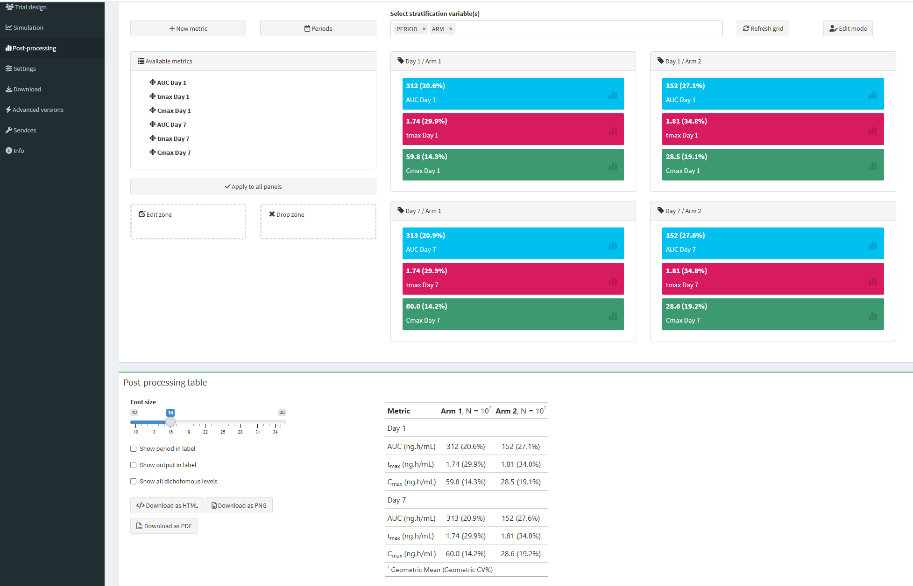

# Post-processing

{width=50px} &nbsp;This feature is reserved for pro users only.

## Step-by-step guide

After a simulation has completed, you can apply post-processing calculations to the simulation results. This way you can for example calculate non-compartmental PK parameters. The post-processing calculation will be performed for each individual separately, but the results can easily be summarized in a table.

{width="628"}

The steps are:

1.  Add the metrics you are interested in

    {width="462"}

    -   Select the output variable that a metric should be derived from (e.g. concentration; must be defined in the [ERROR] section of the model code)

    -   All metrics are computed within a specified time interval

    -   Currently the following NCA metrics are available:

        -   AUC: area under the curve, calculated with the trapezoidal method
        -   Cmax: the maximum value of the selected output variable
        -   Tmax: the time at which the maximum value occurred
        -   Cmin: the lowest value in the interval
        -   Ctrough: the last value in the interval
        -   Cavg: the average concentration derived as: AUC/length_time_interval
        -   thalf: the half-life derived from the slope of the log-transformed variable values against time. **IMPORTANT:** all time points in the interval are used for the calculation. You need to check if this makes sense in your case, since most often you may actually be interested in the terminal part of the curve only.
        -   Max: the maximum value of the selected output variable
        -   Min: the minimum value of the selected output variable
        -   Last:the last value of the selected output variable in the interval
        -   Avg: the average value of the selected output variable in the interval
        -   Custom: a custom metric defined as a function of the selected output variable (see below).
        -   Custom (tbl): a custom metric defined as a function of any other variable available in the dataset (see below).

    -   The default time interval is 0 to the ***last*** time point. You can also select previously defined and labelled periods. By default day 1 and day 7 (i.e. 0-24 and 144-168 hours) are available, but you can easily change this by clicking on the "Periods" button on the main screen.

    -   In the label field you can add your specific label. <METRIC>, <PERIOD> and

        <OUTPUT>

        are placeholders that will be automatically filled in.

    -   Select the summary statistics that you want to use, e.g. mean and CV% or median and interquartile range. It is possible to provide a function for calculating a custom summary statistic.

    -   Choose the desired rounding method and the precision level.

2.  Back on the main screen you can (and should) stratify the post-processing by SCENARIO, ARM, PERIOD (if it was defined), or by the OUTPUT variable if you choose different ones. Categorical covariates may also be used as stratification variables.

3.  Click "Refresh grid"

    -   Boxes for the different strata will appear.

4.  Click the button 'Apply to all panels'

    -   Most often you want to calculate the same metrics in all strata
    -   However, it is also possible to apply different metrics to different strata. In this case simple drag-and-drop the metric to the strata box you want
    -   {width="400"}

5.  Click on the Calculate button !

    {width="494"}

6.  You can then download the table as pdf, png or html file

Description of the options:

-   Edit zone: click on a metric and drag it to this zone to edit it
-   Drop zone: if a metric had to be remove from one of the stratification, drag-and-drop to this zone. If you want to delete a metric once for all, edit the metric and click the "Delete" button in the dialog box.
-   Refresh grid: to reset boxes according to the given stratification variables and corresponding values in the simulated results

## Custom metrics

It is possible to define custom metrics. This can be done in two ways:

### Calculated from the vector of the output variable

If you select "Custom" as the metric type, you can define a custom metric as a function of the output variable. For example, you can derive the percentage of patients with the output variable (or derived metric thereof) exceeds a certain threshold for that individual. The function should be defined in R syntax and entered in the appropriate field:

{width="462"}

You can access the vector of the output variable by using `.y` and the vector of the time points by using `.x`. For example, the following custom function returns the maximum value of the output variable:

`~ max(.y)`

or use just the shortcut function:

`~ Max`

#### Some Examples

**Return categorical endpoint**

To check if the value of output variable (e.g. concentration) at the end of the interval is above 10 simply write:

`~ Last > 10`

This will evaluate to TRUE if the last concentration in the interval is above 10, and FALSE otherwise. You would need to check "Categorical endpoint" in this case.

In fact you can use standard R syntax as well as dplyr commands and return a text string instead of TRUE/FALSE:

`~case_when(Cmax < 50 ~ "P(< 50 ng/mL)", Cmax >= 50 & Cmax <= 60 ~ "P(50-60 ng/mL)", Cmax > 60 ~ "P(> 60 ng/mL)")`

**Calculate the maximum change from baseline**, assuming that the baseline value is the first value of the output variable in our observation interval:

`~ max(.y) - .y[1]`

or

`~ Max - first(.y)`

**Return the value of the output variable at a specific time point** within the interval, you can use the following syntax:

`~ .y[.x == 4]`

Remember `.y` is the selected output variable and `.x` is the time vector. The above example will return the value of the output variable at time = 4. However, this of course only works if the time point you specify actually exists in the dataset.

For advanced users:

There is a special function `iValue` that works together with the campsisnca metric objects, e.g.:

`~ AUC() %>% iValue(.x,.y)`

### Calculated from a combination of variables in the dataset

If you select "Custom (tbl)" as the metric type, you can define a custom metric as a function of any other variable available in the dataset. For example, you can calculate the ratio of two variables at a specific time. The function should be defined in R syntax and entered in the appropriate field:

{width="462"} You can access the temporary dataframe of an individual for which the metric is to be calculated within the specified interval as a tibble object using `.x`. For example, the following custom function returns the ratio of two variables at baseline:

`~ .x$VAR1[1] / .x$VAR2[1]`

#### Examples

**Alternative to calculate the change from baseline**,

for a biomarker (called BIOMARKER). We assume that BASELINE is a variable coming from the model and available in the dataset (i.e. it was defined in the [ERROR] section of the model codel)

`~ max(.x$BIOMARKER) - .x$BASELINE[1]`

Since BASELINE is not time-varying in our model we just use the first value in the vector. Remember

**Calculate the dose-normalized AUC.**

You need to output the current dose in the dataset. For this add the following lines to the [ERROR] section of the model code:

```         
if(EVID==1){
DOSE = self.amt
}
```

Note, this works only with mrgsolve as simulation engine.

Then you can calculate the dose-normalized AUC as follows using the special iValue functions: `~(AUC() %>% iValue(.x$TIME,.x$CONC)) / (Last() %>% iValue(.x$TIME,.x$DOSE))`

**Calculate the ratio of 2 NCA metrics.**

Suppose you want to calculate the ratio of 24-hour AUCs on day 7 and day 1, this can be done as follows:

`~(AUC() %>% iValue(.x %>% timerange(144, 168) %>% pull(TIME), .x %>% timerange(144, 168) %>% pull(CONC))) / (AUC() %>% iValue(.x %>% timerange(0, 24) %>% pull(TIME), .x %>% timerange(0, 24) %>% pull(CONC)))`

Note that the function `timerange` is available in package `campsisnca`. Doing `.x %>% timerange(0, 24)` is equivalent to `.x %>% filter(TIME >=0 & TIME <= 24)` with dplyr.

## Post-processing replication

If you have setup your post-processing by following the steps above for a single replicate, i.e., on the current results you have from the simulation tab, you could be interested to replicate the process, and derive a confidence interval on all the metrics you have computed so far.

The internal process in e-Campsis is as follows:

- For each replicate number:
    - Simulate the replicate with Campsis (exact same configuration as in the simulation tab is used)
    - Derive the NCA metrics at an individual level
    - Summarize the metrics at the level of the replicate
- As an output, the requested summary statistics (e.g. geometric mean and geometric CV on AUC, etc.) per replicate are returned
- The confidence interval is computed on each summarized metric across replicates (e.g. median and 90% CI on geometric mean on AUC, median and 90% CI on geometric CV on AUC, etc.)

The replication of the post-processing is particular useful if you want to simulate a clinical trial (where the number of subjects is limited) and derive a confidence interval on the NCA metrics. Remember that the more subjects you have in your trial, the more precise the confidence interval will be.

Additionally, the replication process automatically takes your variance-covariance matrix into account when simulating the replicates. This means that the uncertainty in the parameter estimates is propagated to the NCA metrics. As a consequence, the confidence intervals on the NCA metrics will be wider if the uncertainty in the parameter estimates is large; and they will be always larger than simulating without parameter uncertainty.

For setting up the variance-covariance matrix, please have a look at the forest plots [configuration](forest-plots.html#variance-covariance-matrix) which also requires a variance-covariance matrix to work properly.

### Basic example

Let's illustrate this feature with a very basic example. Take the default model (no parameter uncertainty), trial design and simulation settings in e-Campsis. In the post-processing setup, define the AUC metric. Select the following statistic: `{geomean}({geocv}%)`.

Click then on `Calculate`. The post-processing table should look as follows:


Now, go to the post-processing replication box. Select 25 replicates, select the following summary statistics `c("{median}", "{p5}", "{p95}")` and click on `Simulate replicates`. The results should look as follows:

{width=70%}

These results show that the confidence interval on the geometric mean of AUC is quite large, which is expected given the small number of subjects in the trial. The same applies to the geometric CV on AUC.

As an exercise, you can increase the number of subjects (e.g. set 250 subjects instead of 10) in the trial design and re-run the post-processing setup and the replication process. You should see that the confidence intervals on the NCA metrics become narrower.

### Advanced example with PoS
