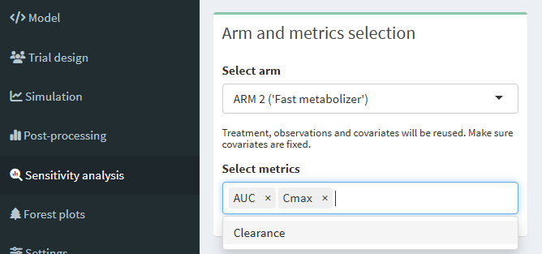
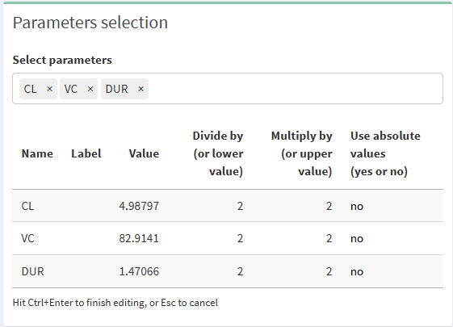
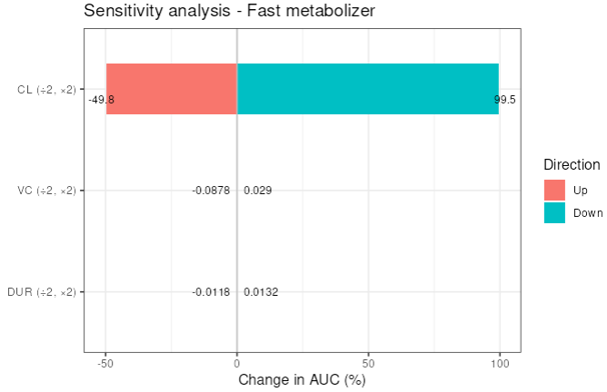
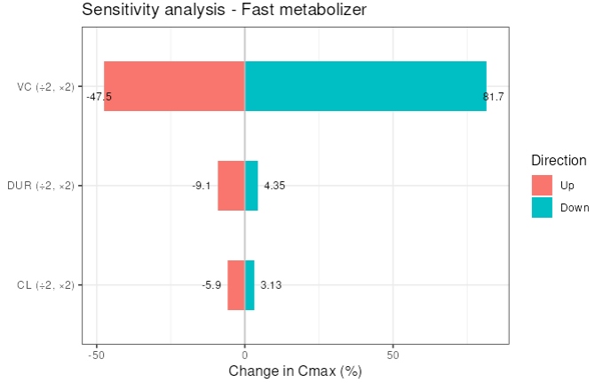

# Sensitivity analysis (pro version only)

## Pre-requisites

You can create a sensitivity analysis on any outcome variable you defined in the post-processing screen. So have a look at the [post-processing](post-processing-pro-version-only.html) section of this document.

## Select outcome variables and study arm

Once you have defined outcome variables, you can go to the sensitivity analysis screen and choose the study arm that should be used for the simulations. In the same box you also select the outcome variables that you want to compute.

## Select the parameters to adapt

In the top-right box you define the parameters that you want to adapt in your sensitivity analysis simulation. For each parameter to adapt, you have 2 possibilities:

- either your specify the factors by which you want to respectively, divide and multiply, the parameter value. Default value is 2 in both directions (i.e. parameter value will be decreased by 50% and will be increased by 100%).
- or you specify the lower and upper value to simulate. This could be, for example, the 5th and 95th percentile of that parameter's distribution, or any other value you deem appropriate to test. In this case, please replace `no` by `yes` in the `Use absolute value` column.

Note: to edit the table, please double click on any cell. To finish editing, hit `Ctrl + Enter`, or `Esc` to cancel.

## Run sensitivity analysis simulation

If you are ready click on "Run simulation". Use the `Previous` and `Next` buttons to navigate through the different metrics you chose.

For instance, the plot below shows what happens on AUC if the clearance, the volume of distribution and the infusion duration are respectively divided by 2 and multiplied by 2. Since the model is linear, we see that only the clearance affects the AUC.

The second plot shows the same sensitivity analysis but on Cmax. As expected, the volume of distribution drives the Cmax. The infusion duration and the clearance both play a minor role.

Always remember that your metrics are calculated on the simulated data, which depends on your design. So, be careful about the sampling you use or to the observation window you look at.

Enjoy the sensitivity analysis tab. Don't hesitate to reproduce your results offline thanks to our package `campsismisc`.
