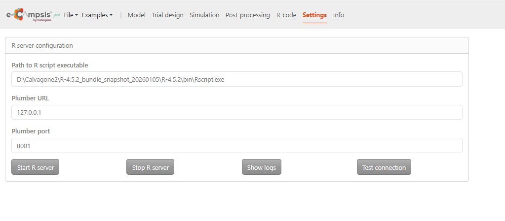
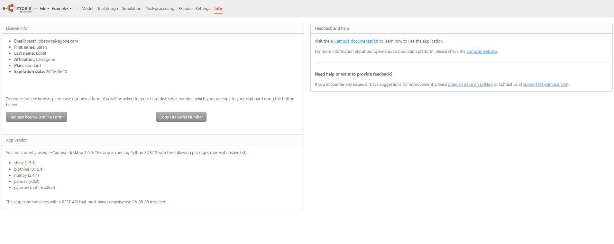

# Settings

The **Settings** tab allows configuration of the R server used by the application. Users can specify the path to the Rscript executable, as well as the host URL and port for the Plumber API. The interface also provides controls to start or stop the R server, view execution logs, and test the connection to ensure proper communication between the application and the R environment.

# Info

The **Info** tab provides details about the user license, application version, and available support resources. It displays license information such as the registered user, affiliation, plan type, and expiration date, with options to request a new license or copy the device’s serial number. The page also includes links to documentation and support channels for help or feedback. In addition, it reports the current application version, runtime environment, and key dependencies used by the software, helping users verify their installation and troubleshoot potential issues.

