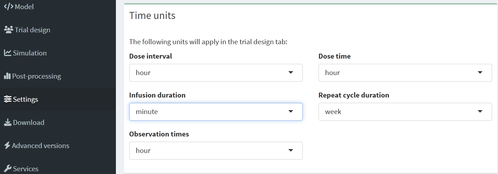

# Settings

## Time units

Campsis includes functions that automatically take care of converting time units. First you need to make sure that the time scale of your model (i.e. your differential equations) is correctly set (hours by defualt). Go back to the model section. Above the parameter tables you will find a dropdown menu where you can select the time unit of your model.

{width="385"}

Now go to settings and chose the unit in which you would like to specify the time of dosing, the dosing interval, infusion duration, observation times

{width="385"}

Later, when you run the simulation you can specify the time unit to be used in the plots.

{width="385"}

The following video also shows how to set the units:

<iframe width="560" height="315" src="https://www.youtube.com/embed/Il3Z56sG34g?si=CQkpb8IvMOdfZwRz" title="YouTube video player" frameborder="0" allow="accelerometer; autoplay; clipboard-write; encrypted-media; gyroscope; picture-in-picture; web-share" referrerpolicy="strict-origin-when-cross-origin" allowfullscreen>

</iframe>
