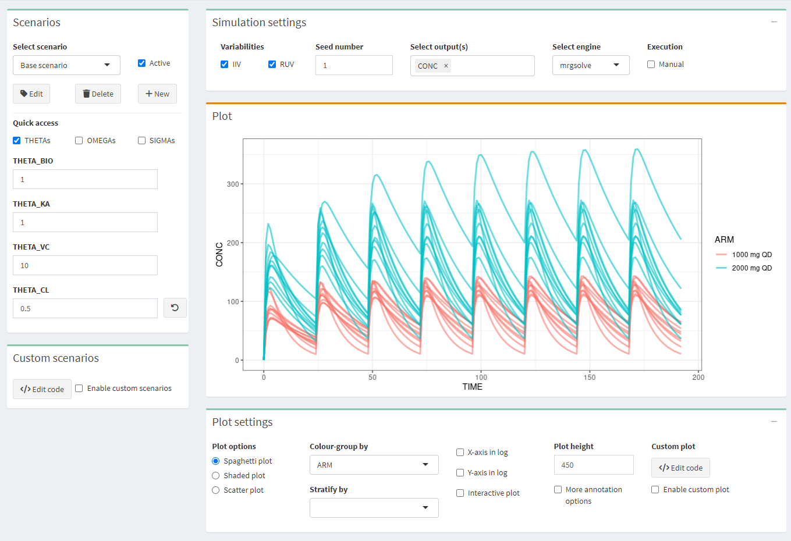
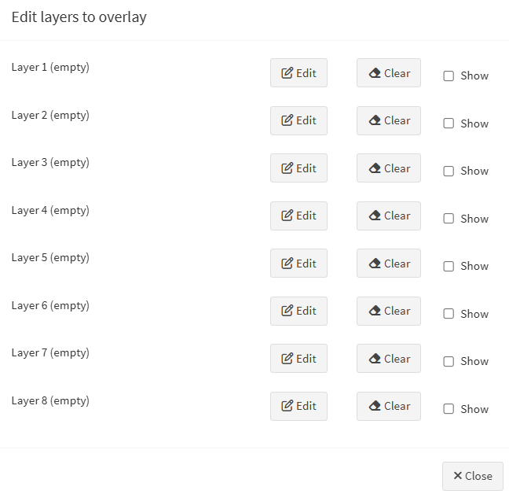
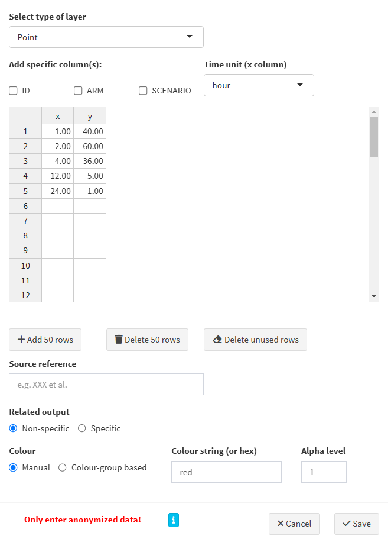
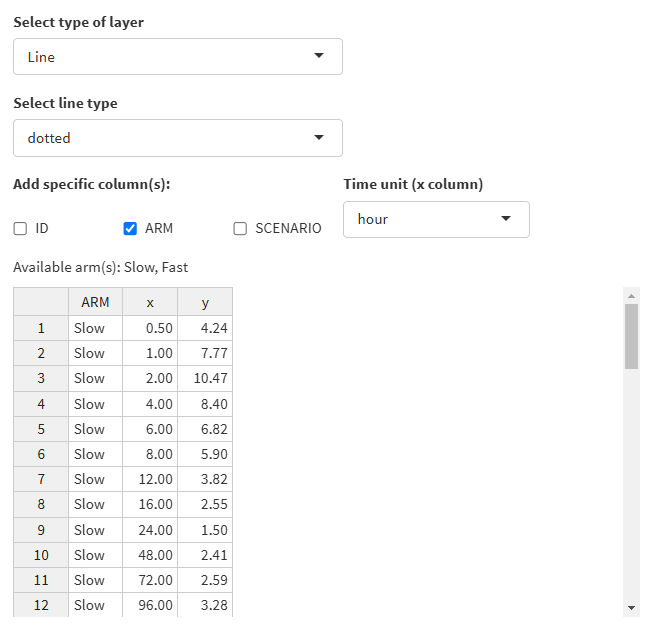
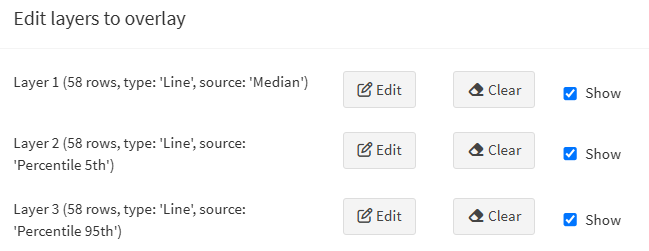
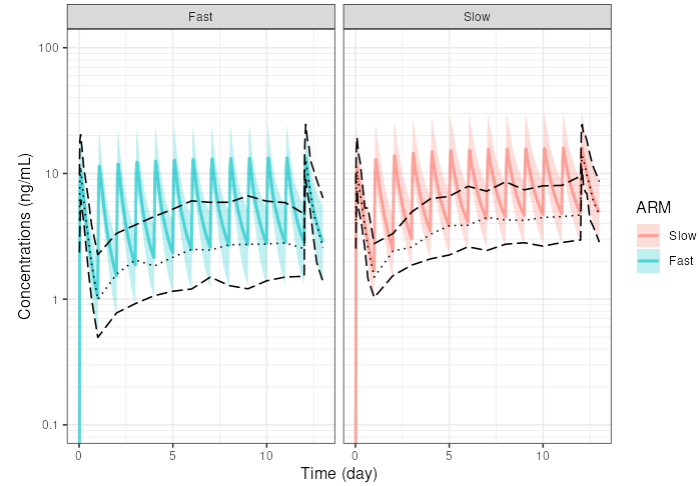

# Simulation

{width="561"}

## Scenarios

Make several scenarios that you want to compare. For each scenario, parameter values can be changed. If you use scenarios, make sure to apply the appropriate stratification or color-grouping in the Plot settings.

## Simulation settings

-   IIV/RUV: Should the inter-individual and residual variability be taken into account in the simulations? Check IIV or RUV boxes accordingly. **IMPORTANT:** If you simulate only 1 subject with the intention of simulating a typical profile, make sure that IIV is switch off!
-   Seed: a seed number can be used.
-   Select output(s): select one or several outputs you would like to look at.
-   Select engine: choose one of the two simulation packages rxode2 or mrgsolve.
-   Execution/Manual: check the box to make any changes without updating the plot and, when all is configured, click the "play" button $\vartriangleright$

## Plot settings

Click "+" to pull the tab down.

-   Three plot options can be chosen:

    -   spaghetti plot: overlay of the individual profiles of the selected output(s) versus time
    -   shaded plot: median of the simulated output(s) versus time with 5th and 95th percentiles of the simulations
    -   scatter plot: relationship between two selected outputs

-   Colour-group by: profiles will have different colors by ARM or SCENARIO

-   Stratify-group by: split the plots by ARM or SCENARIO

-   X-axis or Y-axis in log: select to show the X- or Y-axis on log scale

-   Interactive plot: when checked, more options on plots are available (from Plotly)

-   Plot height: adjust the height of the figure

-   More annotation options: allows to customize the plot

    -   Plot title
    -   X-axis label, limits, breaks
    -   Y-axis label, limits, breaks
    -   Footnote
    -   Horizontal/Vertical line(s): add one or several horizontal or vertical line(s) to the plot, and select colours and type
    -   Facet scales: scales for facet can be fixed, free, or free in one dimension
    -   Facet nrow: number of facets per row
    -   Facet scaled: include or not the facet variable name

-   Data overlay (pro version): Overlay the observed data on the simulated data. See specific section below on how to overlay your external data.

-   Custom plot (pro version): R-code can be edited to directly customize the plot, then check "enable custom plot" to update the plot after editing the code. Click "Generate code from GUI" to update the code from the plot.

## Data overlay

{width=50px} &nbsp;This feature is reserved for pro users only.

e-Campsis offers a very powerful interface to overlay external data on the simulated data. This feature, can be useful to:

- Compare the simulated data with observed data or with summarized observed data (like median, percentiles, etc.)
- Show data from literature (e.g. PK profiles from a publication or confidence intervals at some specific points of the profile, etc.) on top of your plot
- More generally, add any ggplot layer to annotate your plot (e.g. add a label, some text, lines or points, cross bars, etc.)

This section will explain you how to use the functionality.

### Data overlay interface

In the plot settings, click on the "Edit layers" button to open the interface that will allow you to edit up to 8 layers.

{width=60%}

Three actions can be performed on each layer:

- Edit: opens a window where you can edit the layer.
- Clear: removes the layer from the plot. The entered data for this layer will be lost.
- Show: shows or hides the layer on the plot.

### Edit a layer

Click on the "Edit" button to open the layer editor window.

{width=60%}

Here are the steps to follow:

- **Select type of layer**: the following types can be selected: `Point`, `Line`, `Horizontal line`, `Vertical line`, `Point range`, `Step`, `Error bar`, `Cross bar`, `Text` and `Label`. Based on your selection, the required column names (aesthetics in the ggplot2 terminology) will be displayed in the table and will have to be filled in with your data.
- **Add specific columns**:
  - ID: needed if your external data refers to individuals
  - ARM: may be needed if you have more than 1 arm in your simulation
  - SCENARIO: may be needed if you have more than 1 scenario in your simulation
- **Time unit**: select the time unit of your data. This is important to ensure that the data is correctly overlaid on the plot.
- **Table**: enter your data in the table. The table content can be edited directly in the interface. You can also copy-paste your data from an external source (e.g. a CSV or Excel file).
- **Add/Delete rows**: use these buttons to add or delete 50 rows at once in the table.
- **Delete unused rows**: delete empty/unused rows.
- **Source reference**: add a reference to the source of your data. This will be shown in the generated R code.
- **Related output**: 
    - Non-specific: the data will be overlaid on all outputs.
    - Specific: the data will be overlaid on the selected output(s).
- **Colour**:
    - Manual: in that case, specify the colour string to use (name or hex code).
    - Colour-group based: the data will be coloured based on stratification variable used for colouring the plot.
- **Alpha level**: indicate the transparency level of the layer, a number between 0 and 1.

Once your data is entered and your layer is configured, click on the "Save" button to save the layer. The layer will be added to the plot.

### Example: overlay summarised observed data on simulated data

Let's say you have rich observed data for the median and 5th and 95th percentiles of the concentrations at Day 1 and Day 13, and trough concentrations for all days in between (your drug is given once daily). You have in your dataset slow metabolisers and fast metabolisers. You want to overlay this data on the simulated concentration profiles.

In your trial design, you do also simulate two arms, the first one with slow metabolisers and the second one with fast metabolisers.

Here is how you can proceed:

- Prepare your data in a CSV/Excel file with the following columns: `ARM`, `TIME`, `MEDIAN`, `P5`, `P95`
- Column arm should be mapped to the ARM column in e-Campsis. E.g. use 'Slow' and 'Fast' as values, which are the same as in your trial design.
- Edit the first layer and enter the median. Select `Line` as the type of layer. Select `dotted` as the line type. Select the `ARM` checkbox. Fill in the required columns `ARM`, `x` (=`TIME`) and `y` (=`MEDIAN`) by copy pasting the data from your CSV/Excel file. Select the time unit of your data and click save.

As an example, you could have the following data:

{width=60%}

- Add a second layer for the 5th percentile and provide the corresponding data. Select `longdash` as the line type.
- Add a third layer for the 95th percentile and provide the corresponding data. Select `longdash` as the line type.

Your layers should look like this:

{width=60%}

That's it. Your plot will now show the simulated profiles with the median, 5th and 95th percentiles overlaid on top.

{width=60%}

