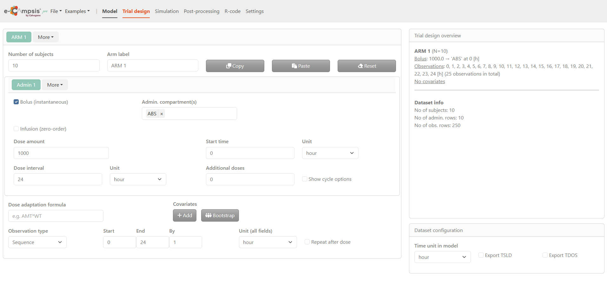
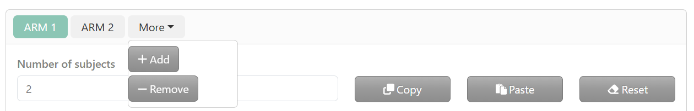
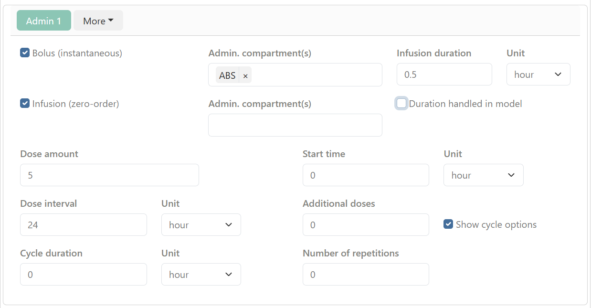
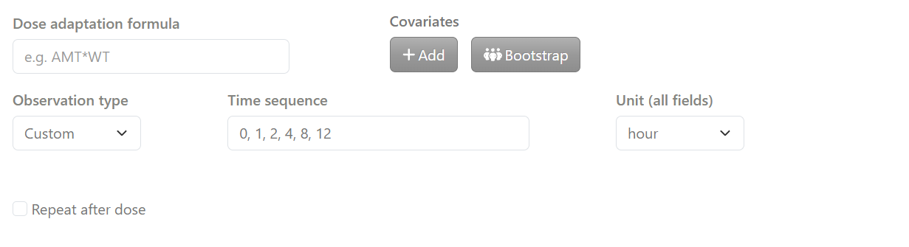
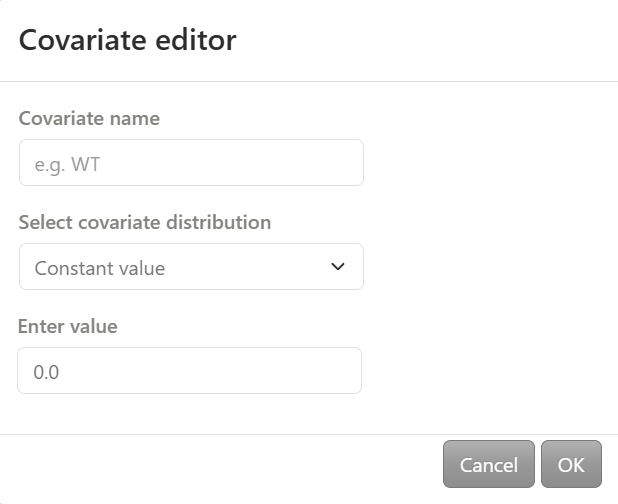
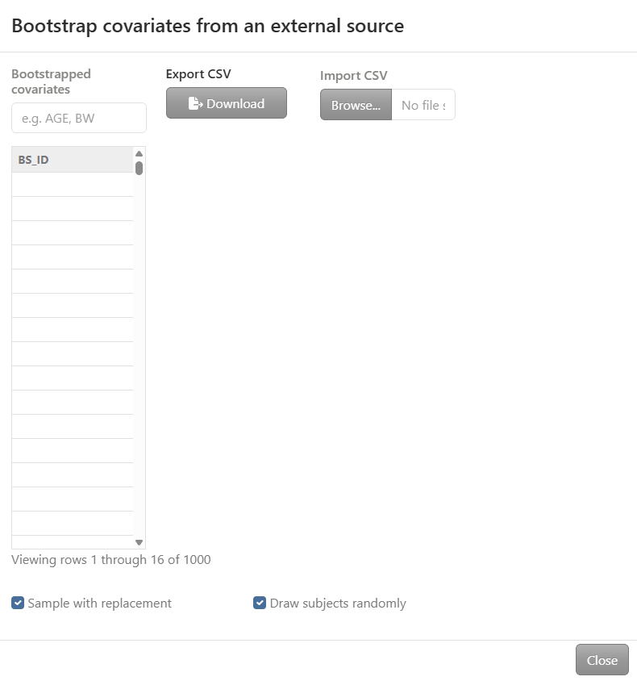
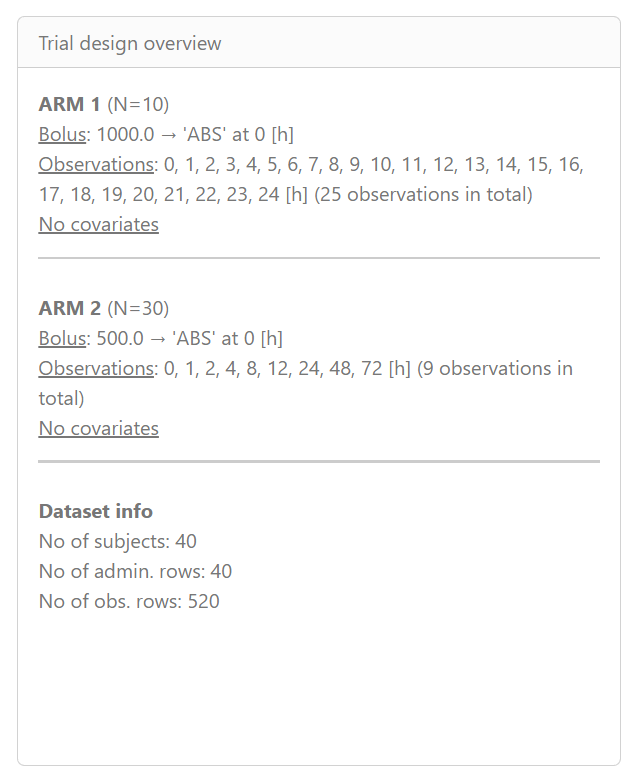
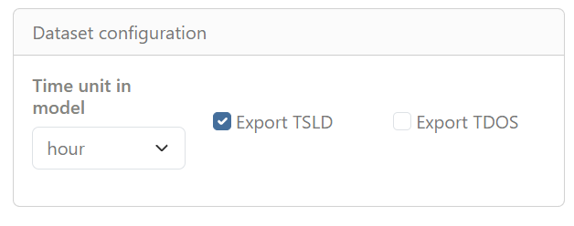

# Trial design tab

By clicking on the **Trial design** tab, the e‑campsis application displays a structured and interactive environment to set up the study design prior to running simulations. This page is divided into two main sections:

* On the left, the *Trial configuration* section serves as the main configuration area and is used to define treatment arms, subject numbers, administration details (dose, interval, route), and observation settings.
* On the right, the Summary area provides an overview of the current configuration, with the *Trial design overview* displayed at the top and the *Dataset configuration* section at the bottom, where the model time unit is defined.

## Trial configuration section

In the *Trial configuration* section, study arms and all associated dosing, covariate, and observation settings are defined. By default, one study arm (**ARM 1**) is available. By clicking **More**, additional arms can be added or existing arms removed. When an arm is removed, the most recently created arm is deleted.

For each arm tab, the configuration is organized into three main subsections.

### Arm definition

This subsection defines the general characteristics of the study arm.

* **Number of subjects**: The number of subjects to be simulated for the selected arm is entered here.

* **Arm label**: The label used to identify the arm in plots and tables is defined in this field.

Action buttons labeled **Copy**, **Paste**, and **Reset** are displayed next to the arm label. These buttons allow duplication of an existing arm configuration, pasting of a copied configuration, or restoration of default values.

### Administration settings

This subsection defines how the treatment is administered for the selected arm.

By default, one administration (**ADM 1**) is available. By clicking **More**, administrations can be added or removed. 

Two administration types are available:

  * Bolus (instantaneous): When this option is enabled, the administration compartment must be specified.
  * Infusion (zero‑order): When this option is enabled, both the administration compartment and the infusion duration must be specified.
When Duration handled in model is enabled, the infusion duration is controlled by a parameter defined in the model. This option is useful when the infusion represents a zero‑order input with variability or covariate effects (e.g. slow‑release formulations). Additional information is available at:
https://calvagone.github.io/campsis.doc/articles/v06_infusions.html

Multiple administration compartments may be selected when using complex absorption models (e.g. sequential or parallel first‑ and zero‑order inputs).

The following dosing parameters can be configured for each arm:

* Dose amount and start time
* Dosing interval and additional doses
* Cycle duration and number of repetitions, when **Show cycle options** is enabled
Units can be selected independently for each dosing parameter.

### Covariates and observation settings

This subsection defines subject‑level covariates and observation schedules for the arm.

Covariates associated with subjects in the arm are defined, and optional dose‑adaptation rules based on these covariates can be specified (e.g. AMT * BW). By clicking on **add** button, a covariate editor window opens.

The covariate name is defined and a distribution is selected from the following options:

- **Constant value**: a single value is entered
- **Vector of values**: a list of values is entered (e.g. 40, 50, 60)
- **Uniform distribution**: minimum and maximum values are specified
- **Normal distribution**: mean and standard deviation are specified
- **Lognormal distribution**: mean and standard deviation are specified on the log scale
- **Discrete distribution**: discrete values and their corresponding probabilities are entered (each probability must be between 0 and 1)

By clicking on **bootstrap**, covariates are bootstrapped from an external dataset. Data can be copied and pasted directly into the table or imported from a CSV file.Two options are available: *Sample with replacement* and/or *Draw subjects randomly*

Observation times can be defined using one of the following approaches:

*  *Sequence*, where start time, end time, and time step are specified
*  *Custom* where a user‑defined observation time sequence is specified

When **Repeat after dose** is enabled, the observation schedule is replicated after each dose.
Care should be taken when defining the number of observations, as a large number of observation rows can substantially increase the size of the simulated dataset and may result in memory limitations.

## Trial design overview

The Trial design overview panel displays a summary of the defined study arms and the resulting dataset size.

Each study arm is listed with:

* the number of subjects,
* the administration scheme (dose, compartment, and time),
* the observation time points,
* and the presence or absence of covariates.

At the bottom of the panel, the *Dataset info* section summarizes the total dataset size, including the total number of subjects, administration rows, and observation rows generated across all arms.

## Dataset configuration

The Time unit in model field specifies the time unit used throughout the model (e.g. hour).

Two export options are available:

* Export TSLD: exports a dataset including the variable TSLD (Time Since Last Dose).
* Export TDOS: exports a dataset including the variable TDOS (Time of Dosing).

These options control which time‑related variables are included in the exported datasets for simulation.
