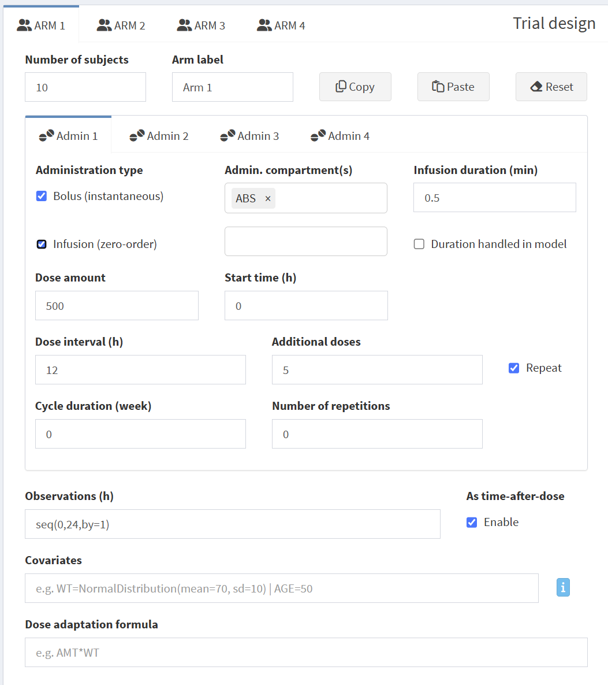
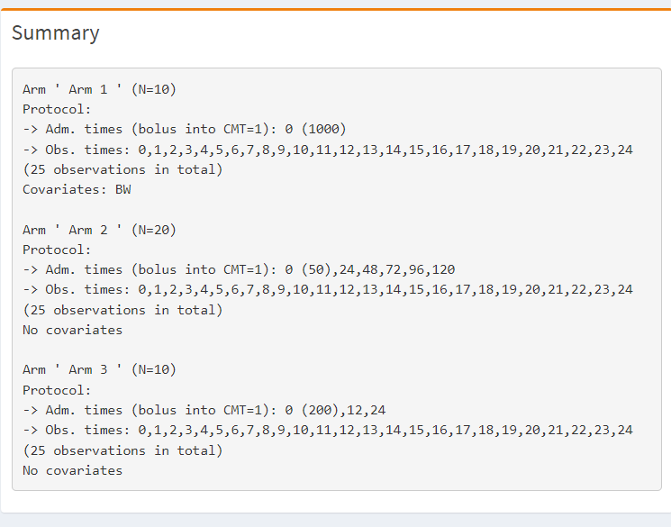
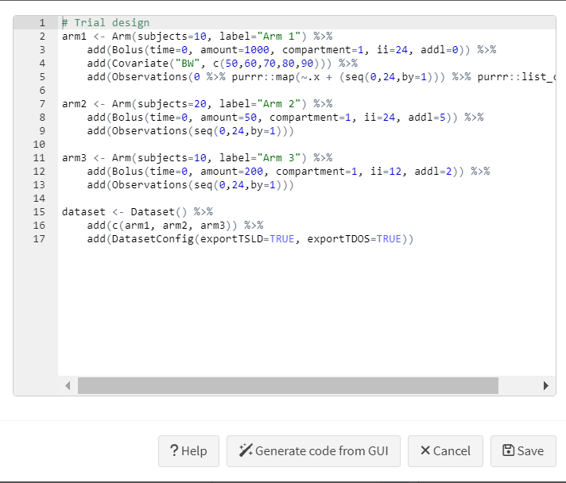
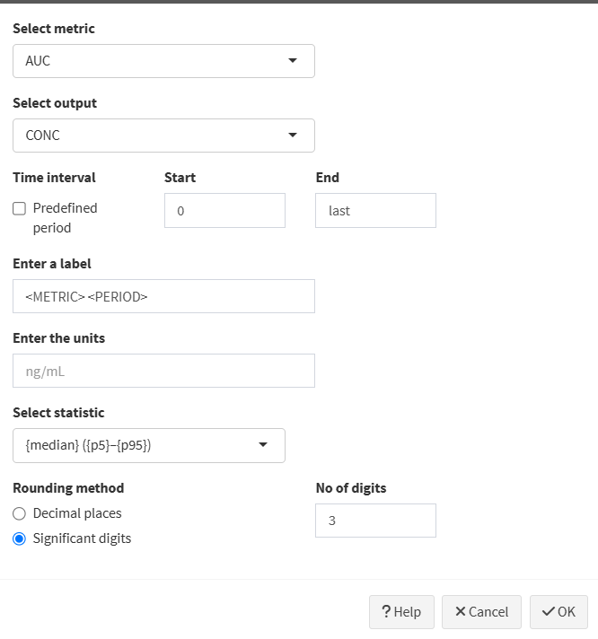
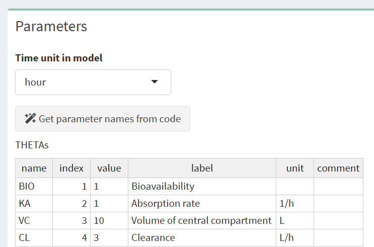
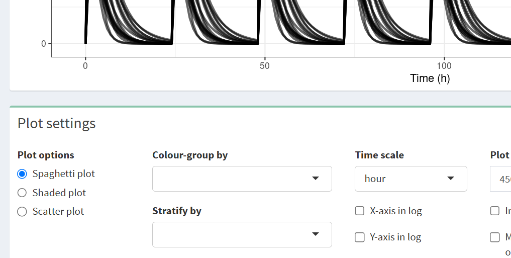

# About

[e-Campsis](https://ecampsis.shinyapps.io/free/) is a free web application developed by [Calvagone](https://www.calvagone.com/) that provides an intuitive and user-friendly interface for setting up population PK/PD simulations. The app is built on the R-package [campsis](https://calvagone.github.io/), which serves as a powerful frontend for running model-based simulations using *mrgsolve* or *rxode2*.

## e-Campsis versions

### e-Campsis free

*e-Campsis free* is, as the name suggests, freely accessible to everyone without registration at <https://ecampsis.shinyapps.io/free/>.

It comes with certain limitations regarding the size of the simulation and misses some functionality of the pro-version.

### e-Campsis free+

If you want to simulate up to 16 arms or scenarios, 100 subjects/arm and 250 observations/arm we invite you to become an authorized user of *e-Campsis free+*.

Please send us the pre-filled email below and you will get an invitation to register as soon as possible:

```{=html}
<a class="mailtoui" href="mailto:campsis@calvagone.com?subject=e-Campsis%20free%2B&amp;cc=&amp;bcc=&amp;body=Hello%2C%20%0A%0A%20I%27d%20like%20to%20get%20access%20to%20e-Campsis%20free%2B.%20%0A%0A%20Thank%20you%2C%20%0A%0A%20%3CYour%20name%3E%20%0A%0ABy%20sending%20this%20e-mail%20I%20agree%20that%20Calvagone%20gets%20in%20touch%20with%20me%20regarding%20Campsis%20and%20associated%20services.%20I%20understand%20that%20Calvagone%20will%20never%20sell%20or%20distribute%20my%20contact%20information%20to%20a%20third%20party%20and%20promises%20to%20keep%20my%20details%20safe%20and%20secure.%20If%20I%20don%27t%20want%20to%20receive%20e-mails%20from%20Calvagone%20anymore%20or%20have%20questions%20around%20their%20GDPR%20compliance%2C%20I%20will%20contact%20them%20at%20contact%40calvagone.com.">campsis@calvagone.com</a>
```
### e-Campsis pro

The professional version of e-Campsis is available as a yearly subscription and includes the following additional functionality:

-   Save/load e-campsis projects
-   NONMEM code import
-   Number of arms, scenarios, subjects, observations only limited by memory
-   Advanced customization of plots
-   NCA & summary statistics
-   Sensitivity analysis\*
-   Forest plots
-   Upload of external data for plotting\*
-   Bootstrap covariates from external file or NHANES\*
-   Replicate simulation with parameter uncertainty
-   Import rxode2 and mrgsolve simulation code\*
-   Personalized support via email

\**Under development.*

For further information, contact us at the following e-mail address: [campsis\@calvagone.com](mailto:campsis@calvagone.com){.email}

## Application interface

The app consists of 5 main sections:

-   **Model**: a powerful model editor to edit your Campsis model online. Try out one of the numerous models available from the library and adapt it to your needs.
-   **Trial design**: an easy-to-use interface to quickly set-up the dosing regimen, observation times and covariates.
-   **Simulation**: a single screen dedicated to the simulation configuration and visualization of the results. Explore different scenarios of parameter settings quickly and interactively.
-   **Post-processing**: here you can define summary variables such as non-compartmental PK parameters that you want to derive from your simulation results and show them in a table.
-   **Forest plots**: Easily define and generate nice-looking forest plots and explore the impact of covariates on any outcome parameter.
-   **Download**: last but not least, download the model, parameters and the whole code of the simulation to reproduce what you see in the app on your computer using the open-source package campsis.

<!--chapter:end:index.Rmd-->

# Model tab


## Model from library

When entering the app, a simple PK model is already loaded by default.

A different PK model can be selected from a large library ("Select PK model").

In "Select category", NONMEM models or models for target-mediated drug disposition (TMDD) can be also loaded.

A PD model can be connected ("Connect PD model") to the PK model. This is done internally via campsismod (see [here](https://calvagone.github.io/campsismod.doc/articles/v06_append_pd_model.html)). If you do this you may have to check that the right PK output goes into the PD part of the model.

## Campsis model import

An existing Campsis model can be uploaded from this box (including files *model.campsis*, *omega.csv*, *theta.csv* and *sigma.csv*).

## NONMEM model import (pro-version)

In the pro version, an existing NONMEM control file (extension *.mod* and *.ctl* ) can be uploaded from this box. The parameter estimates will be extracted from the NONMEM control file unless you also select the corresponding *.ext* file. In this case the final parameter estimates will be used.

When you start the import for the first time it may take a short while (2-3 minutes) for the functionality to be available. A notification will popup when done and you may need to select the NONMEM files you want to import again. 

We have tested the translation of NONMEM models to Campsis for a number of models, but it is possible that some models are not correctly translated or fail. If you encounter such a model, please let us know and we will try to fix it.

In many cases you model will not run immediately after import. This is because you likely have variables (e.g. covariates or flagging variables) in your model that are not defined.
You can either edit the model code directly in the editor window (e.g. TRT = 1) or you can define the variables in the "Trial design" as a covariate.


## Model code

The model code is shown in the editor window where it can be easily modified. Please note that the code is case sensitive (e.g. *log*, *exp*, *sqrt* should be used). The power function is *pow(x,d)*, *x* to the power of *d*.
You can add comments using the # symbol.

Clicking on the "Download" button, Campsis model code will be downloaded as a ZIP folder, including *model.campsis*, *omega.csv*, *theta.csv* and *sigma.csv*.

## Parameters

The list of parameters for THETA, OMEGA and SIGMA is given in this box. Their values and labels can be changed. Comments can be added.

The type for OMEGA and SIGMA can be changed: sd, var, covar, cv, cv%, cor, for standard deviation, variance, covariance, coefficient of variation, coefficient of variation (as %) or correlation, respectively.

Correlations between omegas can be added by right-clicking on a cell in the OMEGA table. For example, enter "KA, VC" as name, 1 and 2 in index and index2, and add the correlation value.

Clicking on "Get parameter names from code", the code will be scanned for the strings *THETA_name*, *ETA_name* and *EPS_name* and the names will be extracted and added to the table.


<!--chapter:end:01-Model.Rmd-->

# Trial design

## Trial design

{width="500"}

The study arms can be configured here.

For each arm tab, the following information can be entered:

-   Number of subjects
    -   When set to 0 this arm is switched off.
-   Arm label
    -   Enter here the text that should appear on plots and tables identifying the study arm
-   Administration type (bolus or infusion)
    -   If infusion is selected, you can choose whether the infusion is in the Model or in the Dataset; if the latter, the infusion duration can be entered
    -   Infusion into the Model means that the infusion duration is controlled by a parameter in the model. This is useful in cases where the infusion is actually not a real infusion but rather a 0-order input and you may have variability or covariates associate with it (e.g. a slow release formulation). See [here](https://calvagone.github.io/campsis.doc/articles/v06_infusions.html) for more information:
-   Dose amount and compartment
    -   The amount given into the specified compartment.
-   Dosing interval and additional doses
    -   The amount is repeatedly administered at a given interval for N additional doses (i.e. number of dosing events in addition to the first one)
-   Observations (observation time)
    -   to be written in R vector notation, e.g. *`seq(0,24,by=1)`*`or c(seq(0, 5), seq(0, 5)+168, seq(0,5)+336, seq(0,504,6))`
    -   Enable the "as-time-after-dose" box, if you want to replicate the observation schedule after each dose
    -   Be mindful with the number of observations that you choose as they contribute significantly to the size of the simulation and may cause memory issues.
-   Covariates
    -   Covariates or indicator variables that are used in the model code
    -   You can enter a single values: e.g. `BW=70|FLAG=1|SEX=1|BW=70`
    -   Or use the Campsis distribution functions, e.g:
        -   `BW=NormalDistribution(mean=70, sd=10)`
        -   `BW=LogNormalDistribution(meanlog=log(70), sdlog=0.2)`
        -   `HT=UniformDistribution(min=150, max=190)`
    -   It is also possible to enter a vector of values like so: `BW=c(50,60,70,80,90)`This is useful if you want to explore only certain specific covariate values. However, in this case you need to make sure that the length of the vector equals the number of subjects in the arm.r
    -   See [here](https://calvagone.github.io/campsis.doc/articles/v03_covariates.html) for more information about covariates:
-   Dose adaptation formula
    -   Useful if the dose has to be adapted to the body weight; e.g. `AMT*BW`

## Summary

{width="484"}

Here you will see a summary of your trial design. Especially when you have multiple arms with different schedules it is useful to have a look here and check if the design was correctly specified.

## Custom dataset

When you click on "Edit dataset" a window will pop-up that allows you to specify complex dosing schedules using the Campsis functions.

{width="470"}

Here you can enter for example loading doses or specific titration schemes etc.

[See the Campsis help](https://calvagone.github.io/campsis.doc/articles/v01_dataset.html) for details on how to enter complex trial designs.

<!--chapter:end:02-Trial-design.Rmd-->

# Simulation

{width="561"}

## Scenarios

Make several scenarios that you want to compare. For each scenario, parameter values can be changed. If you use scenarios, make sure to apply the appropriate stratification or color-grouping in the Plot settings.

## Simulation settings

-   IIV/RUV: Should the inter-individual and residual variability be taken into account in the simulations? Check IIV or RUV boxes accordingly. **IMPORTANT:** If you simulate only 1 subject with the intention of simulating a typical profile, make sure that IIV is switch off!
-   Seed: a seed number can be used.
-   Select output(s): select one or several outputs you would like to look at.
-   Select engine: choose one of the two simulation packages rxode2 or mrgsolve.
-   Execution/Manual: check the box to make any changes without updating the plot and, when all is configured, click the "play" button $\vartriangleright$

## Plot settings

Click "+" to pull the tab down.

-   Three plot options can be chosen:

    -   spaghetti plot: overlay of the individual profiles of the selected output(s) versus time
    -   shaded plot: median of the simulated output(s) versus time with 5th and 95th percentiles of the simulations
    -   scatter plot: relationship between two selected outputs

-   Colour-group by: profiles will have different colors by ARM or SCENARIO

-   Stratify-group by: split the plots by ARM or SCENARIO

-   X-axis or Y-axis in log: select to show the X- or Y-axis on log scale

-   Interactive plot: when checked, more options on plots are available (from Plotly)

-   Plot height: adjust the height of the figure

-   More annotation options: allows to customize the plot

    -   Plot title
    -   X-axis label, limits, breaks
    -   Y-axis label, limits, breaks
    -   Footnote
    -   Horizontal/Vertical line(s): add one or several horizontal or vertical line(s) to the plot, and select colours and type
    -   Facet scales: scales for facet can be fixed, free, or free in one dimension
    -   Facet nrow: number of facets per row
    -   Facet scaled: include or not the facet variable name

-   Custom plot (pro version): R-code can be edited to directly customize the plot, then check "enable custom plot" to update the plot after editing the code. Click "Generate code from GUI" to update the code from the plot.

<!--chapter:end:03-simulation.Rmd-->

# Post-processing (pro version only)

## Step-by-step guide

After a simulation has completed, you can apply post-processing calculations to the simulation results. This way you can for example calculate non-compartmental PK parameters. The post-processing calculation will be performed for each individual separately, but the results can easily be summarized in a table.

{width="628"}

The steps are:

1.  Add the metrics you are interested in

    {width="462"}

    -   Select the output variable that a metric should be derived from (e.g. concentration; must be defined in the [ERROR] section of the model code)

    -   All metrics are computed within a specified time interval

    -   Currently the following NCA metrics are available:

        -   AUC: area under the curve, calculated with the trapezoidal method
        -   Cmax: the maximum value of the selected output variable
        -   Tmax: the time at which the maximum value occurred
        -   Cmin: the lowest value in the interval
        -   Ctrough: the last value in the interval
        -   Cavg: the average concentration derived as: AUC/length_time_interval
        -   thalf: the half-life derived from the slope of the log-transformed variable values against time. **IMPORTANT:** all time points in the interval are used for the calculation. You need to check if this makes sense in your case, since most often you may actually be interested in the terminal part of the curve only.
        -   Max: the maximum value of the selected output variable
        -   Min: the minimum value of the selected output variable
        -   Last:the last value of the selected output variable in the interval
        -   Avg: the average value of the selected output variable in the interval
        -   Custom: a custom metric defined as a function of the selected output variable (see below).
        -   Custom (tbl): a custom metric defined as a function of any other variable available in the dataset (see below).

    -   The default time interval is 0 to the ***last*** time point. You can also select previously defined and labelled periods. By default day 1 and day 7 (i.e. 0-24 and 144-168 hours) are available, but you can easily change this by clicking on the "Periods" button on the main screen.

    -   In the label field you can add your specific label. <METRIC>, <PERIOD> and

        <OUTPUT>

        are placeholders that will be automatically filled in.

    -   Select the summary statistics that you want to use, e.g. mean and CV% or median and interquartile range. It is possible to provide a function for calculating a custom summary statistic.

    -   Choose the desired rounding method and the precision level.

2.  Back on the main screen you can (and should) stratify the post-processing by SCENARIO, ARM, PERIOD (if it was defined), or by the OUTPUT variable if you choose different ones. Categorical covariates may also be used as stratification variables.

3.  Click "Refresh grid"

    -   Boxes for the different strata will appear.

4.  Click the button 'Apply to all panels'

    -   Most often you want to calculate the same metrics in all strata
    -   However, it is also possible to apply different metrics to different strata. In this case simple drag-and-drop the metric to the strata box you want
    -   {width="400"}

5.  Click on the Calculate button !

    {width="494"}

6.  You can then download the table as pdf, png or html file

Description of the options:

-   Edit zone: click on a metric and drag it to this zone to edit it
-   Drop zone: if a metric had to be remove from one of the stratification, drag-and-drop to this zone. If you want to delete a metric once for all, edit the metric and click the "Delete" button in the dialog box.
-   Refresh grid: to reset boxes according to the given stratification variables and corresponding values in the simulated results

## Custom metrics

It is possible to define custom metrics. This can be done in two ways:

### Calculated from the vector of the output variable

If you select "Custom" as the metric type, you can define a custom metric as a function of the output variable. For example, you can derive the percentage of patients with the output variable (or derived metric thereof) exceeds a certain threshold for that individual. The function should be defined in R syntax and entered in the appropriate field:

{width="462"}

You can access the vector of the output variable by using `.y` and the vector of the time points by using `.x`. For example, the following custom function returns the maximum value of the output variable:

`~ max(.y)`

or use just the shortcut function:

`~ Max`

#### Some Examples

**Return categorical endpoint**

To check if the value of output variable (e.g. concentration) at the end of the interval is above 10 simply write:

`~ Last > 10`

This will evaluate to TRUE if the last concentration in the interval is above 10, and FALSE otherwise. You would need to check "Categorical endpoint" in this case.

In fact you can use standard R syntax as well as dplyr commands and return a text string instead of TRUE/FALSE:

`~case_when(Cmax < 50 ~ "P(< 50 ng/mL)", Cmax >= 50 & Cmax <= 60 ~ "P(50-60 ng/mL)", Cmax > 60 ~ "P(> 60 ng/mL)")`

**Calculate the maximum change from baseline**, assuming that the baseline value is the first value of the output variable in our observation interval:

`~ max(.y) - .y[1]`

or

`~ Max - first(.y)`

**Return the value of the output variable at a specific time point** within the interval, you can use the following syntax:

`~ .y[.x == 4]`

Remember `.y` is the selected output variable and `.x` is the time vector. The above example will return the value of the output variable at time = 4. However, this of course only works if the time point you specify actually exists in the dataset.

For advanced users:

There is a special function `iValue` that works together with the campsisnca metric objects, e.g.:

`~ AUC() %>% iValue(.x,.y)`

### Calculated from a combination of variables in the dataset

If you select "Custom (tbl)" as the metric type, you can define a custom metric as a function of any other variable available in the dataset. For example, you can calculate the ratio of two variables at a specific time. The function should be defined in R syntax and entered in the appropriate field:

{width="462"} You can access the temporary dataframe of an individual for which the metric is to be calculated within the specified interval as a tibble object using `.x`. For example, the following custom function returns the ratio of two variables at baseline:

`~ .x$VAR1[1] / .x$VAR2[1]`

#### Examples

**Alternative to calculate the change from baseline**,

for a biomarker (called BIOMARKER). We assume that BASELINE is a variable coming from the model and available in the dataset (i.e. it was defined in the [ERROR] section of the model codel)

`~ max(.x$BIOMARKER) - .x$BASELINE[1]`

Since BASELINE is not time-varying in our model we just use the first value in the vector. Remember

**Calculate the dose-normalized AUC.**

You need to output the current dose in the dataset. For this add the following lines to the [ERROR] section of the model code:

```         
if(EVID==1){
DOSE = self.amt
}
```

Note, this works only with mrgsolve as simulation engine.

Then you can calculate the dose-normalized AUC as follows using the special iValue functions: `~(AUC() %>% iValue(.x$TIME,.x$CONC)) / (Last() %>% iValue(.x$TIME,.x$DOSE))`

**Calculate the ratio of 2 NCA metrics.**

Suppose you want to calculate the ratio of 24-hour AUCs on day 7 and day 1, this can be done as follows:

`~(AUC() %>% iValue(.x %>% timerange(144, 168) %>% pull(TIME), .x %>% timerange(144, 168) %>% pull(CONC))) / (AUC() %>% iValue(.x %>% timerange(0, 24) %>% pull(TIME), .x %>% timerange(0, 24) %>% pull(CONC)))`

Note that the function `timerange` is available in package `campsisnca`. Doing `.x %>% timerange(0, 24)` is equivalent to `.x %>% filter(TIME >=0 & TIME <= 24)` with dplyr.

<!--chapter:end:04-post-processing.Rmd-->

# Forest plots (pro version only)

## Pre-requisites

### variance-covariance matrix

For a proper forest plot with error bars of uncertainty you will need to import a NONMEM model with a successful covariance step. So when importing a NONMEM model into e-Campsis make sure to select also the .cov file.


A massage below the parameter tables will show if the variance-covariance matrix was properly loaded from the .cov file.

{width="467"}

Since the variance-covariance matrix is dependent on the parameter estimates, any change you now make manually to the parameter tables would invalidate the variance-covariance matrix and it won't be available for the forest plot simulations (or replicate simulations with uncertainty).

You still can create the forest plots as described below, however, they would not include error bars of uncertainty and just show you the mean covariate impact.

### Study design

You need to setup a trial arm first with dosing and sampling scheme, before you can run a forest plot. As you will see below, you will be able to use practically any derived variable for a forest plot, including design-sensitive NCA parameters, like half-life or Cmax, so be sure to choose apropriate sampling times.

Although not strictly required to run the forest plot, it is a good idea to enter the default covariate values here in the covariates field. This way you can check in the simulation tab that the profile for a typical or reference subject looks correct.


### Define outcome variables

You can create forest plots on any outcome variable you defined in the post-processing screen. So have a look at the post-processing section of this document.

Note that in order to use model parameters in the post-processing like CL or V, they need to appear in the [ERROR] block of the code - possibly with a different name to avoid conflicts.

## Select outcome variables and study arm

Once you have done the pre-work, you can go to the forest plot screen and choose the study arm that should be used for the simulations. In the same box you also select the outcome variables that you want to use.


## Select the covariates and define the values to explore

In the box on the top-right you define the covariate that you want to include in your forest plot simulations. Can can enter useful labels and add the units.


For continuous covariates you enter the default value, i.e. the value of the reference subject, as well as the lower and upper value to simulate. This could be, for example, the 5th and 95th percentile of that covariate's distribution, or any other value you deem appropriate to show.

For categorical covariates, you would enter the levels and map the numeric values to strings.

## Set the forest plot items

Now you can choose how many forest plot scenarios or items you want to simulate. Each items corresponds to a an error bar in the plot.

You can also select several covariate values to simulate the effect of several covariates together.

{width="233"}

## Run the simulation

If you are ready click on "Run simulation".

The confidence intervals in a forest plot will be generated by replicate simulations with random sampling from the variance-covariance matrix.

Since this is quite coputationally intensive and may take a while, we suggest you only run a few replicates online and if you are satisfied with the plots you download the automatically generated R-code and execute the big simulation on your computer offline (see section 'download').

The check-box 'parallel' execution and 'number of cores' have currently no effect for online execution. However, the corresponding code for running the simulation in parallel will be included in the downloadable R-script.

Once the simulation is finished you can change some plot settings to adjust the axis limits and breaks as well as the reference range and click through the results - one plot per outcome variable.


<!--chapter:end:05-forest-plots.Rmd-->

# Download

In the download section you can see the full R-code to run the simulation on your local machine. There are checkboxes that allow to include/remove certain sections that may not be needed.


Of course, post-processing or forest plot code can only be included in the script if you have run that simulation before.

Click the Download button to download zip file containing the full Campsis script as well as the model code and parameter tables. The script can be run locally with the open-source packages **campsis, campsismod, campsismisc and campsisnca.**

## Renv for total reproduceability (pro version only)

Simulations with e-Campsis depend on many R packages and it is quite likely that a script that runs today on your computer with the current versions of dependencies may not run without issues in a year or so when you update your R-installation the next time. To overcome this R-specific challenge you can include a `renv::use` block in your simulation script.

When you then execute the script on your computer a temporary renv-package library will be generated and all dependencies will be downloaded and installed with the exact same version as indicated. This will allow you to reproduce your simulations also 5 years from now without issues.

There are only two requirements for this to work:

1) renv must be installed in your R-environment first (read more about renv [here](https://rstudio.github.io/renv/articles/renv.html).

2) you need a C++ compiler to run `mrgsolve`. For Windows you simply need to install [Rtools](https://cran.r-project.org/bin/windows/Rtools/rtools44/rtools.html) first (currently version 4.4) . For mac and linux you need to install a fortran compiler (see [here](https://github.com/metrumresearchgroup/mrgsolve/wiki/mrgsolve-Installation#compilers-buid-tools) for instructions).

<!--chapter:end:06-download.Rmd-->

# Settings

## Time units

Campsis includes functions that automatically take care of converting time units. First you need to make sure that the time scale of your model (i.e. your differential equations) is correctly set (hours by defualt). Go back to the model section. Above the parameter tables you will find a dropdown menu where you can select the time unit of your model.

{width="385"}

Now go to settings and chose the unit in which you would like to specify the time of dosing, the dosing interval, infusion duration, observation times

{width="385"}

Later, when you run the simulation you can specify the time unit to be used in the plots.

{width="385"}

The following video also shows how to set the units:

<iframe width="560" height="315" src="https://www.youtube.com/embed/Il3Z56sG34g?si=CQkpb8IvMOdfZwRz" title="YouTube video player" frameborder="0" allow="accelerometer; autoplay; clipboard-write; encrypted-media; gyroscope; picture-in-picture; web-share" referrerpolicy="strict-origin-when-cross-origin" allowfullscreen>

</iframe>

<!--chapter:end:07-Settings.Rmd-->

# Feedback and help

On the [**Campsis**](https://calvagone.github.io/) website, you will find extensive information about the open-source Campsis simulation platform. There you will also find a section on e-Campsis, including example use cases.

If you run into problems using e-Campsis, please provide your feedback here: <https://github.com/Calvagone/ecampsis.feedback/issues>

# Disclaimer

e-Campsis is provided "as is", without warranty of any kind, express or implied, including but not limited to the warranties of merchantability, fitness for a particular purpose and noninfringement. In no event shall Calvagone SAS be liable for any claim, damages or other liability, whether in an action of contract, tort or otherwise, arising from, out of or in connection with the software or the use or other dealings with the software. Calvagone reserves the right to discontinue the service at any time.

# Terms and Conditions

{width="21cm" height="29cm"}

<!--chapter:end:08-Info.Rmd-->

